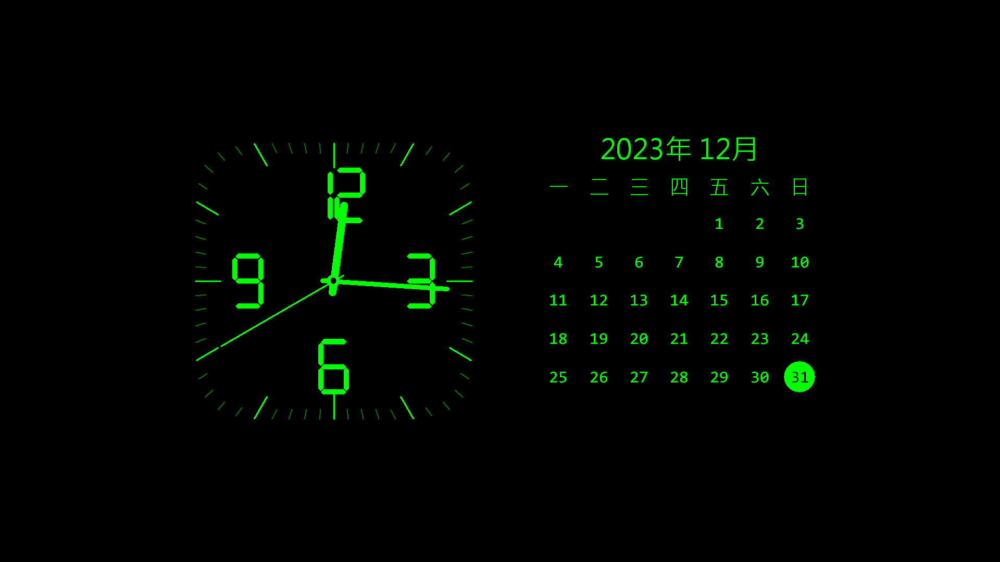
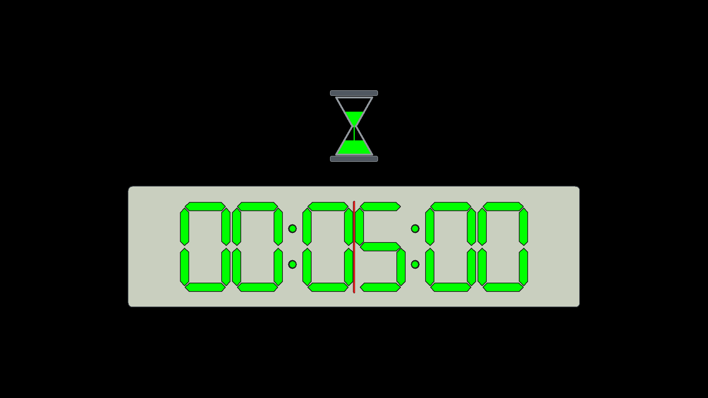

# tools-screensaver-tzk

[](https://github.com/kisaraki/tools-screensaver-tzk/actions/workflows/ci.yml)
[](https://github.com/kisaraki/tools-screensaver-tzk/actions/workflows/pages.yml)
[](https://github.com/kisaraki/tools-screensaver-tzk/releases)
[](LICENSE)

tools-screensaver-tzk 是以 Rust、原生 Win32／GDI 與 WebView2 製作的 Windows x64 螢幕保護程式，提供「標準桌曆暨時鐘模式」、「離機作業番茄鐘模式」與「日本旅行模式」。前兩種模式可完全離線使用；日本旅行模式只在正式全螢幕啟動時連線，並將影片保持靜音。

[專案網站與下載頁](https://kisaraki.github.io/tools-screensaver-tzk/) · [v0.6.0 發行說明](https://github.com/kisaraki/tools-screensaver-tzk/releases/tag/v0.6.0) · [完整開發規格](tools-screensaver-tzk_Codex_Spec.md) · [解除安裝](#uninstall)



> **v0.6.0 是未簽章的開發候選版。** Setup 新增 WebView2 Runtime 偵測與缺少時補裝。Windows 10 x64 的非互動建置、46 個預設測試、19 個安裝判斷測試、smoke 與封裝已通過。37 張 GDI fixture 沿用 v0.5.0；旅行來源紀錄沿用 v0.4.0，Runtime 僅重做唯讀偵測；實際影片播放、連續輪換、多螢幕旅行畫面與長時間資源觀察仍為 `NOT TESTED`。安裝／升級／解除安裝矩陣及 Windows 11 尚未驗證。

## 下載

| 檔案 | 用途 |
| --- | --- |
| [tools-screensaver-tzk-Setup.exe](https://kisaraki.github.io/tools-screensaver-tzk/downloads/v0.6.0/tools-screensaver-tzk-Setup.exe) | 建議使用的 Windows x64 安裝程式；GitHub Pages 匿名直連 |
| [tools-screensaver-tzk.scr](https://kisaraki.github.io/tools-screensaver-tzk/downloads/v0.6.0/tools-screensaver-tzk.scr) | 獨立螢幕保護程式檔，供進階使用者或檢查；GitHub Pages 匿名直連 |
| [SHA256SUMS.txt](https://kisaraki.github.io/tools-screensaver-tzk/downloads/v0.6.0/SHA256SUMS.txt) | 兩個成品的 SHA-256；GitHub Pages 匿名直連 |

目前 v0.6.0 成品：

| 成品 | SHA-256 |
| --- | --- |
| `tools-screensaver-tzk.scr` | `3f4e1f1ea7e4ef86a8438467483814989356e075d6605f71f541beafdfaf9cf8` |
| `tools-screensaver-tzk-Setup.exe` | `f5c2cc3843aa9d35153b4b20ab496d9978e164a944b30813afe0376bf73a6c97` |

## 安裝與使用

1. 下載 Setup 與 `SHA256SUMS.txt`，先以 `Get-FileHash -Algorithm SHA256` 比對檔案。
2. 執行 Setup。安裝程式需要系統管理員權限，會將唯一的 `.scr` 安裝到 64 位元 Windows 的 System32。
3. 「將它設為目前的螢幕保護程式」預設不勾；需要時可在安裝時勾選，或稍後從 Windows 的螢幕保護程式設定選取。
4. 以 `/c` 開啟設定，選擇畫面、主色與字型；日本旅行模式另可選「自在飛行」或「列車旅行」。按「確定」才會保存個人設定，設定畫面不會立即連網。

### Setup 的 WebView2 Runtime 階段

日本旅行模式需要 Microsoft Edge WebView2 Evergreen Runtime。Setup 會檢查電腦層級的 Runtime，並在「準備安裝」摘要顯示偵測結果：

- **已安裝**：顯示版本並略過 Runtime 安裝。
- **尚未安裝**：預設勾選安裝 WebView2，使用內附的 Microsoft 官方 Evergreen Bootstrapper 連網下載並靜默安裝，再重新檢查是否安裝成功。此程序沿用 Setup 的系統管理員權限。
- **只使用離線模式**：可取消 WebView2 選項，日期時鐘與番茄鐘仍可使用。若網路、Proxy 或公司原則導致安裝失敗，Setup 會停止並顯示錯誤，讓你重試或返回取消該選項；若 Runtime 要求重新啟動，請重啟後再執行 Setup。

本 Setup 為所有使用者安裝 `.scr`，因此以電腦層級 Runtime 為準；只存在於某個帳號的 Runtime 不視為所有使用者皆可用，Setup 會提供電腦層級安裝。只有下載 `.scr` 而未使用 Setup 時，需自行準備 Runtime。[Microsoft 官方下載與部署說明](https://learn.microsoft.com/en-us/microsoft-edge/webview2/concepts/distribution)

Bootstrapper 已內附，完整 Runtime 仍需在安裝時從 Microsoft 下載；它是共用元件，依 Microsoft 相關條款使用，不屬於本專案 MIT License。來源與封裝驗證見 [WebView2 部署紀錄](docs/webview2-setup.md)。螢幕保護程式本身不會下載、安裝 Runtime 或要求提權；缺少 Runtime 或 player 建立失敗時保留可退出的靜態 fallback。

成品沒有 Authenticode 簽章，因此 Windows 會顯示未驗證發行者或 SmartScreen 提示。

自 v0.4.0 起，產品內部識別、System32 檔名、Registry key 與 WebView2 資料目錄統一為 `tools-screensaver-tzk`。改名前版本的個人偏好不會自動遷移；實際覆蓋升級與舊 System32 檔清理需在可顯示 UAC 的 Win10 環境驗證，目前為 `NOT TESTED`。

<a id="uninstall"></a>

## 解除安裝（Uninstall）

### 使用 Setup 安裝的版本

1. 先退出螢幕保護程式與預覽／設定視窗。在 Windows 開始功能表搜尋「變更螢幕保護程式」，將螢幕保護程式改為「無」或其他項目，按「套用」。共用電腦上，其他選用本程式的帳號也需各自變更。
2. 按 `Win + R`，輸入 `appwiz.cpl` 並按 Enter，開啟「程式和功能」。
3. 選取 **tools-screensaver-tzk**，按「解除安裝」並依精靈完成。移除 System32 中的程式需要系統管理員權限，Windows 可能要求 UAC 確認；若精靈要求重新啟動，請依提示完成。

解除安裝程式會移除已安裝的 `.scr`，但不會自動變更任何帳號目前選用的螢幕保護程式，因此請先完成步驟 1。從下載資料夾刪除 `tools-screensaver-tzk-Setup.exe` 本身不會解除安裝。

### 只下載或手動放置 `.scr` 的版本

先依上述步驟 1 停用並退出程式，再刪除自己放置的 `tools-screensaver-tzk.scr`。若曾手動複製到 System32，請用檔案總管刪除 `%WINDIR%\System32\tools-screensaver-tzk.scr`；此操作需要系統管理員權限。這類版本通常不會出現在「程式和功能」清單中。

### 個人設定與旅行快取（選擇性）

解除安裝會保留個人設定與旅行模式的本機資料，方便重新安裝後沿用。若要一併清除，請在程式完全退出後，以需要清理的使用者帳號操作：

- **顯示偏好**：按 `Win + R`，輸入 `regedit`，找到 `HKEY_CURRENT_USER\Software\tools-screensaver-tzk`；可先匯出備份，再只刪除這個機碼。
- **旅行模式本機資料**：在檔案總管網址列輸入 `%LOCALAPPDATA%\KOMSMOS`，只刪除其中的 `tools-screensaver-tzk` 資料夾。這會移除 WebView2 profile、快取與本機 player shell。

清除後會失去該帳號的已儲存偏好與快取。Microsoft Edge WebView2 Runtime 是其他應用程式也可能使用的共用元件，解除安裝本程式不需要移除它。

## 功能

- **置中留白**：桌曆時鐘與番茄鐘在寬至少 640 px 且高至少 360 px 的畫面，收進中央 64% 寬、60% 高的內容區；左右各留 18%、上下各留 20% 初始空間。內容區面積比先前縮小約 47%，小型預覽保持可讀性。
- **標準桌曆暨時鐘模式**：圓角方形刻度鐘、連續移動的指針、星期一為首欄的六列 Gregorian 月曆，以及今天的圓形標示。
- **離機作業番茄鐘模式**：六位七段數字、沙漏、剩餘比例線、最後十秒警示與歸零閃爍。
- **日本旅行模式**：可選原客艙窗框更名後的「自在飛行」，或以暖色木質、拱形頂棚、窗列和餐桌座位為設計語彙的「列車旅行」。兩者都顯示目前城市／地區與 tw.live 所整理的 YouTube 即時影像；player 回報 `PLAYING` 後預抓不同候選，滿 60 秒時切換。
- **來源復原**：內建 8 個 tw.live camera ID 候選，每輪最多檢查 3 個；目錄、來源解析或 player 失敗時有界重試，沒有可用來源時顯示靜態 fallback。
- **多螢幕旅行畫面**：主螢幕只建立一個自動播放 player；其他螢幕顯示靜態伴隨畫面，避免同時建立多個直播 player。
- **個人化**：深紅、深橘、亮綠、灰白四色；電子錶、Consolas、新細明體及自訂系統字型。
- **設定識別**：原生設定畫面以程式圖示搭配「KOMSMOS TOOLKIT 探真拓知酷」小型標示。
- **Windows 整合**：支援 `/s` 全螢幕、`/p HWND` 系統預覽與 `/c` 原生設定對話框。
- **顯示適配**：多螢幕、負座標、每螢幕 DPI、橫向／直向／極小畫面與防烙印位移。
- **執行邊界**：前兩種模式、`/p` 系統預覽及 `/c` 設定預覽不建立 WebView2，也不連公開網站；程式沒有遙測、常駐服務或額外 VC++ Runtime 需求。



## 日本旅行模式的網路與隱私

主要目錄是 [tw.live 日本旅行即時影像](https://tw.live/japan/)，影片以 YouTube 官方嵌入播放器呈現。程式不嵌入 tw.live 整頁，不下載、錄製、轉碼、代理、保存或重新託管影片。「自在飛行」與「列車旅行」框、地名和狀態都位於完整 player 矩形外，不遮蔽影片、品牌、廣告或控制項。

啟動此模式會向 tw.live、YouTube／Google 與影片來源使用的 CDN 傳送正常連線所需的 IP 位址、User-Agent、時間與播放器資料。tw.live、YouTube、攝影機提供者及影片內容不受本專案 MIT License 授權；來源可能改址、下線、限制地區或撤回嵌入。最新候選、探測結果與權利邊界見 [日本旅行模式來源、網路與授權紀錄](docs/japan-travel-sources.md)。

WebView2 的 per-user profile 與本機 player shell 位於 `%LOCALAPPDATA%\KOMSMOS\tools-screensaver-tzk\`。其中不保存影片、音訊或歷史影格。

## 命令列模式

```text
tools-screensaver-tzk.scr /s
tools-screensaver-tzk.scr /p <HWND>
tools-screensaver-tzk.scr /c
```

- `/s`：每台螢幕建立無邊框視窗；標準桌曆暨時鐘模式直接開始，離機作業番茄鐘模式先要求本次時、分、秒，日本旅行模式則在主螢幕初始化 player 並於背景檢查來源。
- `/p <HWND>` 或 `/p:<HWND>`：嵌入 Windows 提供的預覽父視窗；日本旅行模式只顯示無網路靜態示意。
- `/c` 或無參數：開啟原生設定對話框；設定預覽不連網。

正常取消或退出回傳 code `0`；命令列／preview parent 錯誤為 `2`；Win32 初始化或執行期錯誤為 `3`；安裝專用 helper 拒絕或失敗為 `4`。

## 從原始碼建置

必要環境：

- Windows 10 x64 或相容的 x64 Windows 建置環境
- Rust `1.97.1` 與 `x86_64-pc-windows-msvc` target
- MSVC x64 C++ Build Tools 與 Windows SDK
- 封裝時另需 Inno Setup `6.7.3`

專案以 `rust-toolchain.toml` 固定 Rust 版本。Windows 缺少元件時，依專案規則優先使用 `winget` 查詢與安裝官方套件；遠端 runner 應預先配置 MSVC 與 Windows SDK，避免建置途中出現安裝 UI。

```powershell
rustup toolchain install 1.97.1 --profile minimal `
  --component rustfmt --component clippy `
  --target x86_64-pc-windows-msvc --no-self-update

.\scripts\build.bat
```

成功後產生 `dist\tools-screensaver-tzk.scr`。已預先安裝正確 Inno Setup 版本時，可執行：

```powershell
.\scripts\package.bat
```

產物位於 `dist\`；該目錄不進 Git，正式下載檔由 GitHub Release 提供。

## 遠端與 CI 測試

預設驗證路徑全程非互動，不顯示設定視窗、不啟動全螢幕螢幕保護程式、不建立 WebView2 player、不安裝成品、不觸發 UAC，也不變更 Windows 目前的螢幕保護程式設定：

```powershell
.\scripts\build.bat
powershell -NoProfile -NonInteractive -File .\scripts\smoke-test.ps1 `
  -OutputDirectory (Join-Path $env:TEMP 'tools-screensaver-tzk-smoke')
```

`build.bat` 會執行格式檢查、Clippy `-D warnings`、非互動測試與 locked Release build。v0.6.0 的 46 個預設測試通過，另有 9 個互動、長時間或環境測試預設 ignored；19 個 installer policy checks 在不建立精靈、不提權的 harness 通過；GDI 圖片沿用 v0.5.0 的 37 張 fixture，涵蓋置中桌曆時鐘、番茄鐘、大小畫面與旅行場景。smoke 已通過 PE、resources、manifest、版本、imports、靜態 CRT 與無 UI 錯誤路徑檢查；安裝 helper 在非 System32 路徑拒絕時沒有改動系統設定。

公開來源探測必須另行顯式執行；它會連線，但不建立 player 或視窗：

```powershell
powershell -NoProfile -NonInteractive -File .\scripts\check-japan-sources.ps1
```

2026-09-07T20:17:11.3035837+08:00 的結果為 tw.live 日本目錄正常、8／8 內建候選可解析，詳見 [source-health.json](docs/evidence/phase8/source-health.json)。同一輪也以產品實際使用的 WinHTTP 與 HTML parser 明確執行即時來源測試並通過；這些結果仍不代表影片已進入 `PLAYING`。

下列項目只供有本機桌面且可接受視窗／UAC、並已安排復原措施的人工驗收，不由遠端工作階段或 CI 執行：

- `smoke-test.ps1 -Interactive`
- ignored native UI tests
- `observe-phase4.ps1`
- `test-installation.ps1`（會安裝到 System32 並顯示 UAC）
- 日本旅行模式實際播放、至少 5 次 60 秒輪換、多螢幕／DPI、斷網與 30 分鐘資源觀察

缺少可互動環境時，相關驗收維持 `NOT TESTED`。Windows 10 驗證邊界與逐項狀態見 [驗收報告](docs/acceptance-report.md)。

## 專案文件

- [Codex 開發規格 v1.7](tools-screensaver-tzk_Codex_Spec.md)
- [Phase 10 WebView2 安裝階段與驗證報告](docs/phase10-report.md)
- [Phase 9 置中版面與驗證報告](docs/phase9-report.md)
- [Phase 8 產品識別統一與驗證報告](docs/phase8-report.md)
- [Phase 7 雙旅行場景實作與驗證報告](docs/phase7-report.md)
- [Phase 6 日本旅行模式實作與驗證報告](docs/phase6-report.md)
- [日本旅行模式來源、網路與授權紀錄](docs/japan-travel-sources.md)
- [Phase 5 封裝與交付報告](docs/phase5-report.md)
- [AC／UT／MT 逐項驗收報告](docs/acceptance-report.md)
- [視覺參考與自製畫面證據](docs/visual-reference.md)
- [FFI 與 GDI 資源稽核](docs/phase4-ffi-audit.md)

Phase 0～10 報告記錄各階段當時的版本、hash 與限制。目前下載成品以 v0.6.0 的 `SHA256SUMS.txt` 為準；GitHub Pages 直連與 GitHub Release 提供相同的 SCR 與 Setup。

## 授權

原始碼及本專案自製圖形以 [MIT License](LICENSE) 發布，Copyright (c) 2026 kisaraki。MIT License 不涵蓋 tw.live、YouTube、攝影機提供者或第三方影片。程式圖示由本專案自行繪製；使用者提供的私有視覺參考沒有納入公開 repository 或成品。
