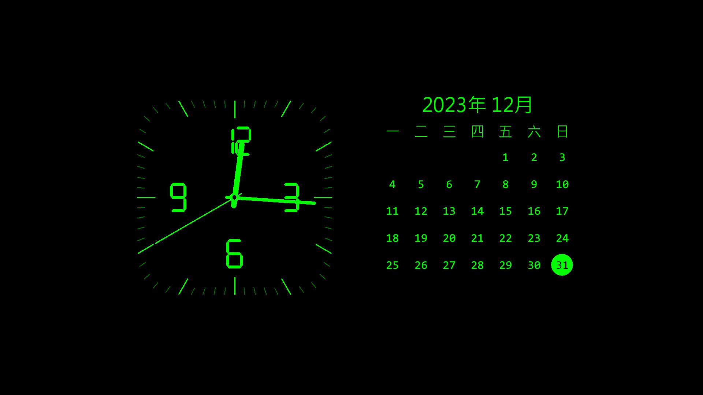
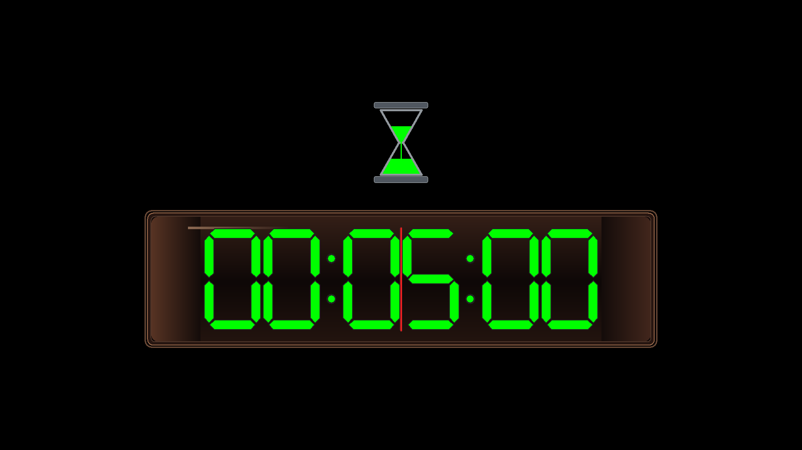

# tools-screensaver-tzk

[](https://github.com/kisaraki/tools-screensaver-tzk/actions/workflows/ci.yml)
[](https://github.com/kisaraki/tools-screensaver-tzk/actions/workflows/pages.yml)
[](https://github.com/kisaraki/tools-screensaver-tzk/releases)
[](LICENSE)

tools-screensaver-tzk 是以 Rust、原生 Win32／GDI 與 WebView2 製作的 Windows x64 螢幕保護程式，提供「標準桌曆暨時鐘模式」、「離機作業番茄鐘模式」與「日本旅行模式」。前兩種模式可完全離線使用；日本旅行模式只在正式全螢幕啟動時連線，並將影片保持靜音。

[專案網站與下載頁](https://kisaraki.github.io/tools-screensaver-tzk/) · [v0.13.0 發行說明](https://github.com/kisaraki/tools-screensaver-tzk/releases/tag/v0.13.0) · [完整開發規格](tools-screensaver-tzk_Codex_Spec.md) · [解除安裝](#uninstall)



> **v0.13.0 是未簽章的開發候選版。** Setup 會檢查既有 tools-screensaver-tzk 的版本；不同版本不能並存，一般安裝會詢問是否先移除既有版本再安裝本版。

## 下載

| 檔案 | 用途 |
| --- | --- |
| [tools-screensaver-tzk-Setup.exe](https://kisaraki.github.io/tools-screensaver-tzk/downloads/v0.13.0/tools-screensaver-tzk-Setup.exe) | 建議使用的 Windows x64 安裝程式；GitHub Pages 匿名直連 |
| [tools-screensaver-tzk.scr](https://kisaraki.github.io/tools-screensaver-tzk/downloads/v0.13.0/tools-screensaver-tzk.scr) | 獨立螢幕保護程式檔，供進階使用者或檢查；GitHub Pages 匿名直連 |
| [SHA256SUMS.txt](https://kisaraki.github.io/tools-screensaver-tzk/downloads/v0.13.0/SHA256SUMS.txt) | 兩個成品的 SHA-256；GitHub Pages 匿名直連 |

| 成品 | Bytes | SHA-256 |
| --- | ---: | --- |
| `tools-screensaver-tzk.scr` | 9,555,456 | `6bbf6ae650aadf59a389476129f3d06ffb0cb20f3507f6842484c0fd8a12e098` |
| `tools-screensaver-tzk-Setup.exe` | 12,608,062 | `ff4689d14f8e421b3613af9cef97e79ef42c5ec801b0b1f810e50129f9c9bcc5` |

## 安裝與使用

1. 下載 Setup 與 `SHA256SUMS.txt`，先以 `Get-FileHash -Algorithm SHA256` 比對檔案。
2. 執行 Setup。安裝程式需要系統管理員權限，會將唯一的 `.scr` 安裝到 64 位元 Windows 的 System32。若偵測到不同版本，確認提示後會先移除舊版，再安裝本版；拒絕則中止。
3. 「設為目前的螢幕保護程式並啟用」預設勾選。安裝完成時會以發起安裝的使用者身分設定 `SCRNSAVE.EXE`、`ScreenSaveActive=1` 與 `ScreenSaveTimeOut=60`，並通知 Windows 立即重新讀取；原有的 `ScreenSaverIsSecure` 登入安全選項保持不變。若不希望 Setup 改變這些個人設定，可在安裝時取消勾選。
4. 公司或學校的群組原則可能覆蓋個人登錄值。若仍未依 1 分鐘準時啟動，請向系統管理員確認「啟用螢幕保護程式」、「螢幕保護程式逾時」及「強制指定螢幕保護程式」原則。
5. 安裝完成頁預設勾選「開啟 tools-screensaver-tzk『設定』面板」，可直接完成模式、主色、字型與旅行切換時間設定；取消勾選便不開啟。靜默安裝不會啟動設定面板。之後也能隨時以 `/c` 開啟；按「確定」才會保存，設定畫面不會立即連網。

### 日本旅行模式的來源切換時間

在設定畫面選取日本旅行模式後，可選「不切換」或按分鐘切換，預設 **每 1 分鐘**，可輸入 **1～1440 的整數分鐘**。每個螢幕在影片實際開始播放後獨立計時；設定於下一次啟動螢幕保護程式時套用。

「不切換」會持續顯示目前可用來源，並停止排程輪換與下一來源預抓。若來源離線或播放失敗，程式仍會尋找其他可用來源。取消設定不會保存變更；舊版本設定升級後預設仍為每 1 分鐘。

### Setup 的 WebView2 Runtime 階段

日本旅行模式需要 Microsoft Edge WebView2 Evergreen Runtime。Setup 會檢查電腦層級的 Runtime，並在「準備安裝」摘要顯示偵測結果：

- **已安裝**：顯示版本並略過 Runtime 安裝。
- **尚未安裝**：預設勾選安裝 WebView2，使用內附的 Microsoft 官方 Evergreen Bootstrapper 連網下載並靜默安裝，再重新檢查是否安裝成功。此程序沿用 Setup 的系統管理員權限。
- **只使用離線模式**：可取消 WebView2 選項，日期時鐘與番茄鐘仍可使用。若網路、Proxy 或公司原則導致安裝失敗，Setup 會停止並顯示錯誤，讓你重試或返回取消該選項；若 Runtime 要求重新啟動，請重啟後再執行 Setup。

本 Setup 為所有使用者安裝 `.scr`，因此以電腦層級 Runtime 為準；只存在於某個帳號的 Runtime 不視為所有使用者皆可用，Setup 會提供電腦層級安裝。只有下載 `.scr` 而未使用 Setup 時，需自行準備 Runtime。[Microsoft 官方下載與部署說明](https://learn.microsoft.com/en-us/microsoft-edge/webview2/concepts/distribution)

Bootstrapper 已內附，完整 Runtime 仍需在安裝時從 Microsoft 下載；它是共用元件，依 Microsoft 相關條款使用，不屬於本專案 MIT License。來源與封裝驗證見 [WebView2 部署紀錄](docs/webview2-setup.md)。螢幕保護程式本身不會下載、安裝 Runtime 或要求提權；缺少 Runtime 或 player 建立失敗時保留可退出的靜態 fallback。

### Setup 的版本衝突處理

- 未安裝本程式時直接繼續；已安裝相同版本時視為修復安裝，不建立第二個解除安裝項目。
- 已安裝較舊或較新版本時，Setup 顯示兩個版本並詢問是否先移除既有版本。選「是」後以既有 uninstaller 移除舊版，確認解除安裝登錄項消失後才繼續；選「否」則結束 Setup。
- 找不到舊版 uninstaller、解除安裝失敗或解除安裝項仍存在時，Setup 會停止，不會安裝第二份。個人模式與外觀偏好保留。
- `/SILENT` 或 `/VERYSILENT` 遇到不同版本時會中止並寫入 Setup log，避免無人操作時自動移除既有版本。

成品沒有 Authenticode 簽章，因此 Windows 會顯示未驗證發行者或 SmartScreen 提示。

自 v0.4.0 起，產品內部識別、System32 檔名、Registry key 與 WebView2 資料目錄統一為 `tools-screensaver-tzk`。改名前版本的個人偏好不會自動遷移；實際覆蓋升級與舊 System32 檔清理需在可顯示 UAC 的 Win10 環境驗證，目前為 `NOT TESTED`。

<a id="uninstall"></a>

## 解除安裝（Uninstall）

### 使用 Setup 安裝的版本

1. 先退出螢幕保護程式與預覽／設定視窗。在 Windows 開始功能表搜尋「變更螢幕保護程式」，將螢幕保護程式改為「無」或其他項目，按「套用」。共用電腦上，其他選用本程式的帳號也需各自變更。
2. 按 `Win + R`，輸入 `appwiz.cpl` 並按 Enter，開啟「程式和功能」。
3. 選取 **tools-screensaver-tzk**，按「解除安裝」並依精靈完成。移除 System32 中的程式需要系統管理員權限，Windows 可能要求 UAC 確認；若精靈要求重新啟動，請依提示完成。

解除安裝程式會移除已安裝的 `.scr`，但不會自動變更任何帳號目前選用的螢幕保護程式，因此請先完成步驟 1。從下載資料夾刪除 `tools-screensaver-tzk-Setup.exe` 本身不會解除安裝。

### 只下載或手動放置 `.scr` 的版本

先依上述步驟 1 停用並退出程式，再刪除自己放置的 `tools-screensaver-tzk.scr`。若曾手動複製到 System32，請用檔案總管刪除 `%WINDIR%\System32\tools-screensaver-tzk.scr`；此操作需要系統管理員權限。這類版本通常不會出現在「程式和功能」清單中。

### 個人設定與旅行快取（選擇性）

解除安裝會保留個人設定與旅行模式的本機資料，方便重新安裝後沿用。若要一併清除，請在程式完全退出後，以需要清理的使用者帳號操作：

- **顯示偏好**：按 `Win + R`，輸入 `regedit`，找到 `HKEY_CURRENT_USER\Software\tools-screensaver-tzk`；可先匯出備份，再只刪除這個機碼。
- **旅行模式本機資料**：在檔案總管網址列輸入 `%LOCALAPPDATA%\KOMSMOS`，只刪除其中的 `tools-screensaver-tzk` 資料夾。這會移除 WebView2 profile、快取與本機 player shell。

清除後會失去該帳號的已儲存偏好與快取。Microsoft Edge WebView2 Runtime 是其他應用程式也可能使用的共用元件，解除安裝本程式不需要移除它。

## 功能

- **置中留白**：桌曆時鐘與番茄鐘在寬至少 640 px 且高至少 360 px 的畫面，收進中央 64% 寬、60% 高的內容區；左右各留 18%、上下各留 20% 初始空間。內容區面積比先前縮小約 47%，小型預覽保持可讀性。
- **標準桌曆暨時鐘模式**：圓角方形刻度鐘、連續移動的指針、星期一為首欄的六列 Gregorian 月曆，以及今天的圓形標示。主色包含雪藍、琥珀與鐵灰色；選擇「自動切換」時每 2 分鐘循環七種固定色，多螢幕共用同一時基。
- **離機作業番茄鐘模式**：六位七段數字、沙漏、剩餘比例線、最後十秒警示與歸零閃爍；計時面板採近黑褐透光核心、平滑上下光衰減、琥珀色瓶壁折射、局部柔光與細銅色唇邊，呈現暗色藥劑瓶玻璃質感。
- **日本旅行模式**：五種內附原創擬真場景，包括「自在飛行」、「列車旅行」、「和風庭園」、「御運轉士」及「地方散策」。御運轉士的播放器貼合寬螢幕窗孔，以 16:9 畫面置中裁掉少量上下內容，避免壓住窗框或在左右留下黑帶；地方散策影片使用強烈攝影暗角，主要視域集中在中央約 65%。換片以兩段動畫先完全閉眼、載入後再睜眼；橢圓眼瞼與模糊黑暈避免筆直銳利邊緣。順暢播放時每 20～30 秒輕眨，緩衝或進度異常時稍慢、稍深地眨眼。
- **旅行切換時間**：預設每 1 分鐘；可選 1～1440 整數分鐘或「不切換」。啟用輪換時，player 回報 `PLAYING` 後才開始計時，於剩餘最後 1 分鐘預抓下一個候選；不切換時仍保留來源失效復原。
- **來源與復原**：自在飛行、列車旅行、御運轉士及地方散策分別使用文件列出的 YouTube 影片清單；全螢幕啟動時由官方 IFrame Player API 讀取清單、隨機排列並選片。和風庭園保留 8 個 tw.live camera ID 候選。輪換前一分鐘先解析下一來源、預選影片候選並預熱縮圖/CDN 連線，切換時從 3:01～8:59 的隨機位置開始播放；無候選時回退到重新讀取清單。清單、來源解析或 player 失敗時有界重試，沒有可用來源時顯示靜態 fallback。
- **多螢幕旅行畫面**：每個螢幕各自建立一個 player，獨立選擇來源、依設定時間輪換並顯示自己的城市與狀態。單一螢幕的來源失敗不會覆蓋其他螢幕的狀態；網路、記憶體與 GPU 用量會隨播放螢幕數增加。
- **播放器外觀**：影片固定靜音並停用控制列、鍵盤、註解與全螢幕按鈕；載入、開始播放及字幕 API 狀態變更時均再次要求卸載字幕模組，播放器也不接受滑鼠事件。來源影片本身燒錄的文字無法由 player 關閉；YouTube 仍可能依平台規則短暫顯示必要的標題或品牌資訊。
- **個人化**：深紅、深橘、亮綠、灰白、雪藍、琥珀、鐵灰色與桌曆時鐘自動換色；自動模式每 2 分鐘循環七種實色。另提供電子錶、Consolas、新細明體及自訂系統字型。
- **設定識別**：原生設定畫面以程式圖示搭配「KOMSMOS TOOLKIT 探真拓知酷」小型標示。
- **Windows 整合**：支援 `/s` 全螢幕、`/p HWND` 系統預覽與 `/c` 原生設定對話框；全螢幕啟動時先把游標移到主要螢幕外角的非播放器區域再隱藏，退出及錯誤清理時還原游標形狀。
- **顯示適配**：多螢幕、負座標、每螢幕 DPI、橫向／直向／極小畫面與防烙印位移。
- **執行邊界**：前兩種模式、`/p` 系統預覽及 `/c` 設定預覽不建立 WebView2，也不連公開網站；程式沒有遙測、常駐服務或額外 VC++ Runtime 需求。



## 日本旅行模式的網路與隱私

四種移動場景使用指定的 YouTube 影片清單；和風庭園沿用 [tw.live 日本旅行即時影像](https://tw.live/japan/) 所解析的 YouTube 即時來源。程式不嵌入 tw.live 整頁，不下載、錄製、轉碼、代理、保存或重新託管影片。場景框、地名和狀態位於 player 矩形外；地方散策以本機兩段動畫在換片時先完全閉眼、載入後再明確睜眼，順暢播放時每 20～30 秒輕眨，網路緩衝時溫和加深。


以上為程式內附的靜態場景素材，沒有載入第三方影片。系統與設定預覽也使用內附圖片，保持離線；正式全螢幕啟動後才在窗景內載入播放器。

啟動此模式會向 tw.live、YouTube／Google 與影片來源使用的 CDN 傳送正常連線所需的 IP 位址、User-Agent、時間與播放器資料。tw.live、YouTube、攝影機提供者及影片內容不受本專案 MIT License 授權；來源可能改址、下線、限制地區或撤回嵌入。最新候選、探測結果與權利邊界見 [日本旅行模式來源、網路與授權紀錄](docs/japan-travel-sources.md)。

WebView2 的 per-user profile 與本機 player shell 位於 `%LOCALAPPDATA%\KOMSMOS\tools-screensaver-tzk\`。其中不保存影片、音訊或歷史影格。

## 命令列模式

```text
tools-screensaver-tzk.scr /s
tools-screensaver-tzk.scr /p <HWND>
tools-screensaver-tzk.scr /c
```

- `/s`：每台螢幕建立無邊框視窗；標準桌曆暨時鐘模式直接開始，離機作業番茄鐘模式先要求本次時、分、秒，日本旅行模式則在每個螢幕初始化 player 並於背景檢查來源。
- `/p <HWND>` 或 `/p:<HWND>`：嵌入 Windows 提供的預覽父視窗；日本旅行模式只顯示無網路靜態示意。
- `/c` 或無參數：開啟原生設定對話框；設定預覽不連網。

正常取消或退出回傳 code `0`；命令列／preview parent 錯誤為 `2`；Win32 初始化或執行期錯誤為 `3`；安裝專用 helper 拒絕或失敗為 `4`。

## 從原始碼建置

必要環境：

- Windows 10 x64 或相容的 x64 Windows 建置環境
- Rust `1.97.1` 與 `x86_64-pc-windows-msvc` target
- MSVC x64 C++ Build Tools 與 Windows SDK
- 封裝時另需 Inno Setup `6.7.3`

專案以 `rust-toolchain.toml` 固定 Rust 版本。Windows 缺少元件時，依專案規則優先使用 `winget` 查詢與安裝官方套件；遠端 runner 應預先配置 MSVC 與 Windows SDK，避免建置途中出現安裝 UI。

```powershell
rustup toolchain install 1.97.1 --profile minimal `
  --component rustfmt --component clippy `
  --target x86_64-pc-windows-msvc --no-self-update

.\scripts\build.bat
```

成功後產生 `dist\tools-screensaver-tzk.scr`。已預先安裝正確 Inno Setup 版本時，可執行：

```powershell
.\scripts\package.bat
```

產物位於 `dist\`；該目錄不進 Git，正式下載檔由 GitHub Release 提供。

## 遠端與 CI 測試

預設驗證路徑全程非互動，不顯示設定視窗、不啟動全螢幕螢幕保護程式、不建立 WebView2 player、不安裝成品、不觸發 UAC，也不變更 Windows 目前的螢幕保護程式設定：

```powershell
.\scripts\build.bat
powershell -NoProfile -NonInteractive -File .\scripts\smoke-test.ps1 `
  -OutputDirectory (Join-Path $env:TEMP 'tools-screensaver-tzk-smoke')
```

`build.bat` 會執行格式檢查、Clippy `-D warnings`、非互動測試與 locked Release build。v0.13.0 的 60 個預設測試通過；互動、長時間或環境測試預設 ignored。另有 19 個 WebView2 與 15 個產品版本 installer policy checks，在不建立精靈、不執行程序、不提權、不顯示提示且不寫 registry 的 harness 通過。

公開來源探測必須另行顯式執行；它會連線，但不建立 player 或視窗：

```powershell
powershell -NoProfile -NonInteractive -File .\scripts\check-japan-sources.ps1
```

2026-09-09 的非互動結果為 tw.live 日本目錄正常、8／8 和風庭園候選可解析，四個指定 YouTube playlist embed endpoint 皆回傳 HTTP 200；詳見 [source-health.json](docs/evidence/phase20/source-health.json)。HTTP 可達仍不代表影片已進入 `PLAYING`。

下列項目只供有本機桌面且可接受視窗／UAC、並已安排復原措施的人工驗收，不由遠端工作階段或 CI 執行：

- `smoke-test.ps1 -Interactive`
- ignored native UI tests
- `observe-phase4.ps1`
- `test-installation.ps1`（會安裝到 System32 並顯示 UAC）
- 日本旅行模式實際播放、至少 5 次預設 1 分鐘輪換、自訂分鐘與不切換、多螢幕／DPI、斷網與 30 分鐘資源觀察

缺少可互動環境時，相關驗收維持 `NOT TESTED`。Windows 10 驗證邊界與逐項狀態見 [驗收報告](docs/acceptance-report.md)。

## 專案文件

- [Codex 開發規格 v2.7](tools-screensaver-tzk_Codex_Spec.md)
- [Phase 20 旅行播放與安裝完成設定報告](docs/phase20-report.md)
- [Phase 19 暗色藥劑瓶玻璃面板報告](docs/phase19-report.md)
- [Phase 18 啟動設定、游標、眨眼與色彩報告](docs/phase18-report.md)
- [Phase 17 播放體驗與顯示名稱報告](docs/phase17-report.md)
- [Phase 16 安裝版本衝突處理報告](docs/phase16-report.md)
- [Phase 15 列車駕駛室與散步暗角報告](docs/phase15-report.md)
- [Phase 14 影片清單、新旅行場景與散步眨眼報告](docs/phase14-report.md)
- [Phase 13 日式旅館與桌曆時鐘色彩報告](docs/phase13-report.md)
- [Phase 12 鐘面、擬真旅行場景與切換設定報告](docs/phase12-report.md)
- [Phase 11 多螢幕旅行修正與驗證報告](docs/phase11-report.md)
- [Phase 10 WebView2 安裝階段與驗證報告](docs/phase10-report.md)
- [Phase 9 置中版面與驗證報告](docs/phase9-report.md)
- [Phase 8 產品識別統一與驗證報告](docs/phase8-report.md)
- [Phase 7 雙旅行場景實作與驗證報告](docs/phase7-report.md)
- [Phase 6 日本旅行模式實作與驗證報告](docs/phase6-report.md)
- [日本旅行模式來源、網路與授權紀錄](docs/japan-travel-sources.md)
- [Phase 5 封裝與交付報告](docs/phase5-report.md)
- [AC／UT／MT 逐項驗收報告](docs/acceptance-report.md)
- [視覺參考與自製畫面證據](docs/visual-reference.md)
- [FFI 與 GDI 資源稽核](docs/phase4-ffi-audit.md)

Phase 0～20 報告記錄各階段當時的版本、hash 與限制。目前下載成品以 v0.13.0 的 `SHA256SUMS.txt` 為準；GitHub Pages 直連與 GitHub Release 提供相同的 SCR 與 Setup。

## 授權

原始碼及本專案自製圖形（含原創 AI 擬真旅行場景）以 [MIT License](LICENSE) 發布，Copyright (c) 2026 kisaraki。MIT License 不涵蓋 tw.live、YouTube、攝影機提供者或第三方影片。程式圖示由本專案自行繪製；使用者提供的私有視覺參考沒有納入公開 repository 或成品。
