# Phase 2 視覺檢查

以下是實際 GDI renderer 的固定資料輸出，經無損 PNG 編碼。不是參考圖或生成式示意圖，也不冒充 Windows 設定面板截圖。

- TimeDate：2023-12-31 12:15:40；星期一為首欄，31 日位於第五日期列、第七欄，第六列保留空間。
- Countdown：總長 10 分鐘、剩餘 5 分鐘；比例 0.5。Debug 互動入口則從固定 5 分鐘真正倒數。
- 所有 fixture 位移固定 `(0,0)`。檔名包含模式、client 尺寸、DPI、色票及字型模式。
- 完整 25 張 PNG 位於 [fixtures](evidence/phase2/fixtures/)；原始 BMP 保存在忽略 Git 的 `target/phase2-fixtures-bmp/`。
- 重建：先載入 MSVC 環境，再於 PowerShell 呼叫 `./scripts/export-phase2-fixtures.ps1`。

## 預設亮綠

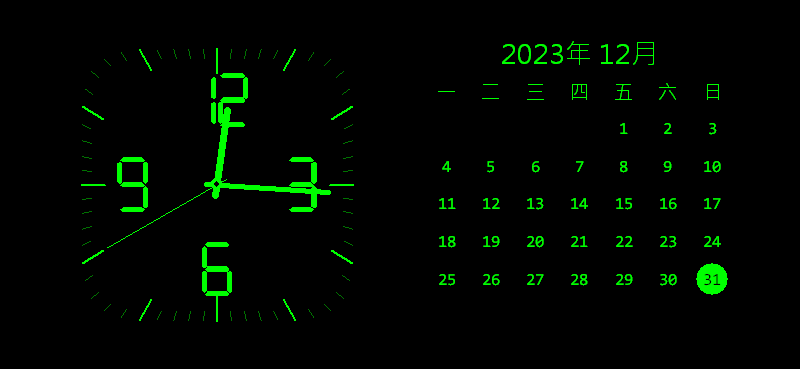

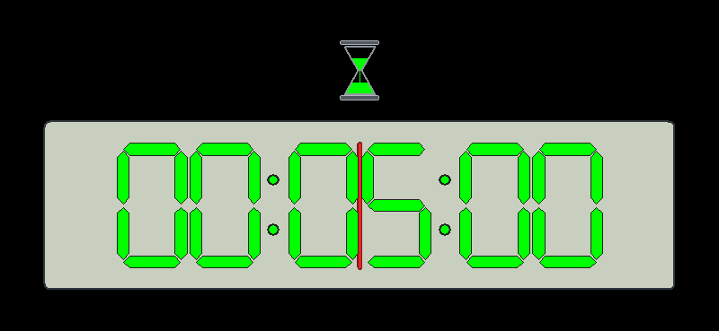

## 色票

| 深紅 | 深橘 |
| --- | --- |
|  | 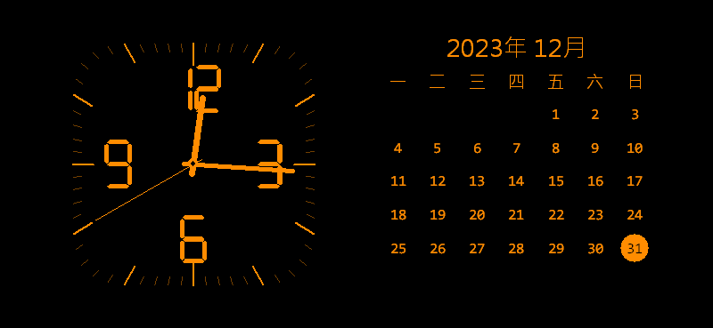 |
| 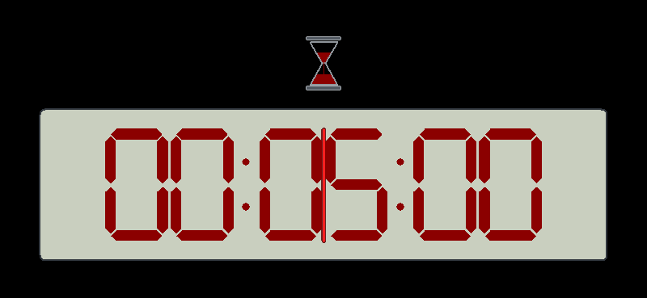 | 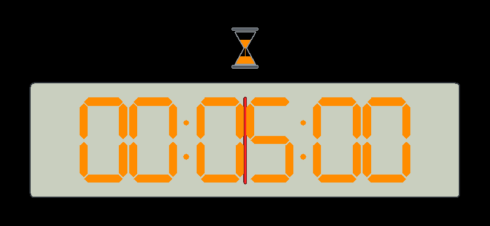 |

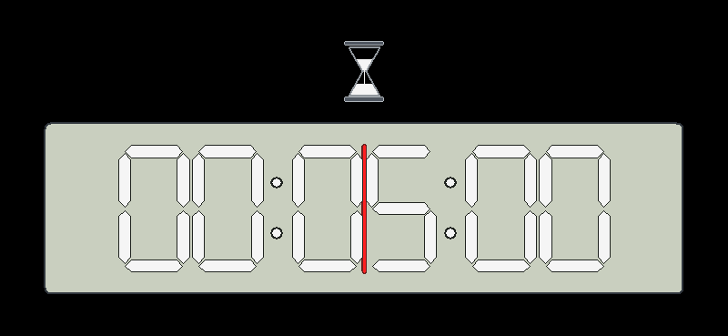

## 倒數邊界

| 最後十秒 | 歸零後的暗半週期 | 閃爍完成 |
| --- | --- | --- |
| 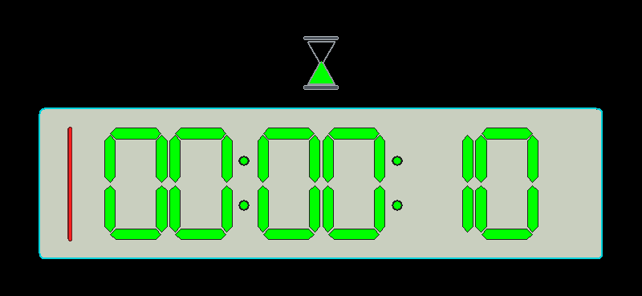 | 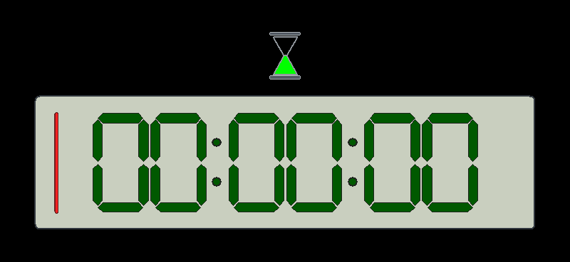 | 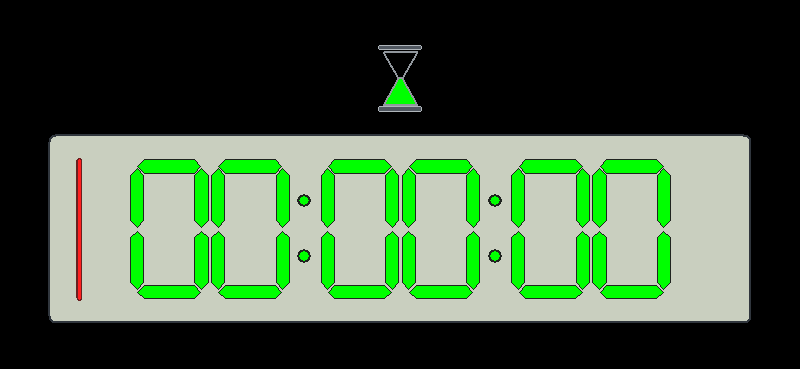 |

## 小型預覽及字型路徑

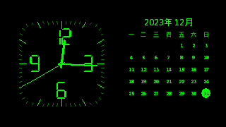

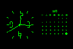
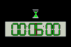

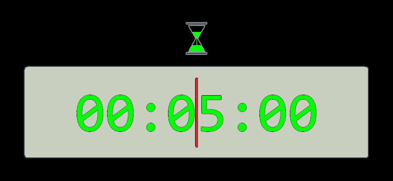
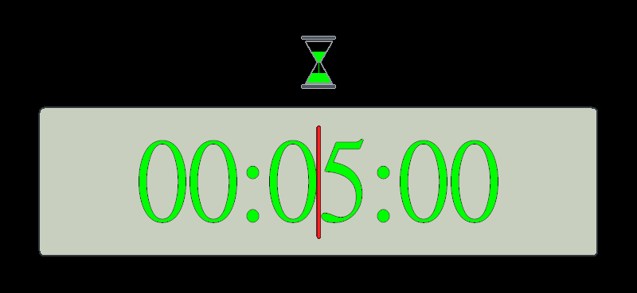

目前僅測繪圖器內部的字型路徑，選字型／自訂偏好介面屬 Phase 3。

## 直向與 4K

原尺寸連結：[直向鐘面](evidence/phase2/fixtures/06-TimeDate-1080x1920-dpi192-p2-SevenSegment-size.png)、[直向倒數](evidence/phase2/fixtures/17-Countdown-1080x1920-dpi192-p2-SevenSegment-size.png)、[4K 鐘面](evidence/phase2/fixtures/05-TimeDate-3840x2160-dpi144-p2-SevenSegment-size.png)、[4K 倒數](evidence/phase2/fixtures/16-Countdown-3840x2160-dpi144-p2-SevenSegment-size.png)。

檢查重點：圓角方形刻度無外圈、中文 fallback、今天實心圓／黑字、六列月曆、七段完整六位數、沙漏 clip、比例線不蓋住數字筆畫、灰白／亮綠輪廓，以及安全矩形之外全黑。
