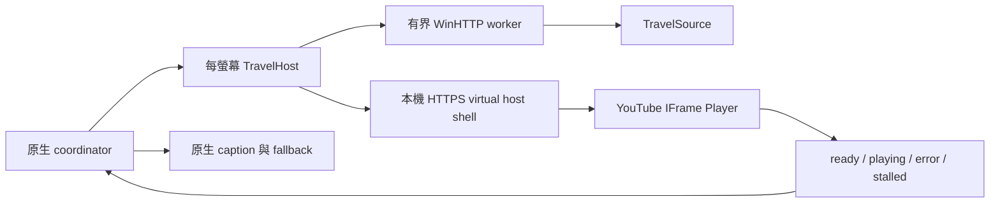

# tools-screensaver-tzk 系統開發規格書

文件版本：1.4

實作基準：產品 v0.15.2、設定 schema 10、Git tag `v0.15.2`

基準日期：2026-09-15

用途：保存目前已實作系統的可重建規格；未來重寫時應以本文件描述的外部行為、資料格式與驗收條件為相容基準。

## 0. 實作快照與文件邊界

本文件記錄 `v0.15.2` 的實作。重建時先以 tag 固定參考原始碼，再依本文件驗證相容性：

| 項目 | v0.15.2 快照 |
| --- | --- |
| Git tag | `v0.15.2` |
| Git commit | 以 `git rev-parse 'v0.15.2^{commit}'` 取得，避免文件提交的自我參照 |
| Cargo／SCR／Setup 版本 | `0.15.2` |
| Registry schema | `10` |
| Rust toolchain | `1.97.1-x86_64-pc-windows-msvc` |
| WebView2 Bootstrapper lock | `1.3.265.7`，1,783,000 bytes，SHA-256 `17debf797a6c737959bc588236e897936ffac1af5f7e515e674ab32f9edfe719` |
| SCR | 20,517,888 bytes，SHA-256 `de9a23b8118b520b8d473acf2bc63619c2e625ccb886c5b20ff54ed5623a712d` |
| Setup | 23,314,635 bytes，SHA-256 `01dbe0558487d675f0a847512285df2db838bb81a519fe70c9c5dce6ae511c0e` |

產品程式碼、安裝器、網站與公開下載是同一個版本集合；規格文件本身可在不變更產品版本的後續文件提交中修訂。若程式行為與本文件衝突，先以該 tag 的實際外部行為及自動測試為證據，修正文件後再進行重寫。

## 1. 產品定位

`tools-screensaver-tzk` 是 Windows x64 原生螢幕保護程式，使用 Rust、Win32/GDI 與 Microsoft Edge WebView2 實作。產品提供四種主模式：

1. **標準桌曆暨時鐘模式**：顯示類比指針鐘及週一為首日的月曆。
2. **離機作業番茄鐘模式**：啟動前輸入倒數時間，顯示沙漏、數字與深色藥劑瓶玻璃進度面板。
3. **日本旅行模式**：以五種擬真框景播放日本地區的 YouTube 影片或 tw.live 即時影像。
4. **即時氣象模式**：依 IP 約略位置或保存城市取得天氣，以八張背景與中央玻璃卡顯示。

日期時鐘、番茄鐘、設定面板與 Windows 預覽必須能離線使用。只有正式全螢幕日本旅行建立 WebView2；氣象及選用的自動更新使用原生 WinHTTP 背景請求。設定／系統預覽保持離線，手動更新按鈕是明確啟動網路工作的例外。

## 2. 支援範圍

| 項目 | 規格 |
| --- | --- |
| 已驗證作業系統 | Windows 10 Education 22H2 x64，build 19045 |
| 安裝器最低版本條件 | Windows 10 x64，build 15063 以上 |
| 尚未驗證 | Windows 11、ARM64、x86、Server、Wine |
| 程式架構 | 原生 Win32 GUI，無主控台視窗 |
| DPI | Per-Monitor V2 |
| Rust | 1.97.1，edition 2021 |
| Rust target | `x86_64-pc-windows-msvc` |
| C Runtime | 靜態 CRT，`target-feature=+crt-static` |
| 安裝器 | Inno Setup 6.7.3 |
| Web 內容 | WebView2 Evergreen Runtime；旅行模式才需要 |
| 授權 | 專案程式碼與自有素材採 MIT；外部影片與 Runtime 不屬於 MIT 範圍 |

## 3. 產品識別與成品

下列名稱是相容性契約，不得在重寫時混用舊名稱：

| 用途 | 值 |
| --- | --- |
| Cargo package／binary | `tools-screensaver-tzk` |
| 螢幕保護程式檔 | `tools-screensaver-tzk.scr` |
| 安裝程式 | `tools-screensaver-tzk-Setup.exe` |
| 安裝目錄 | `%ProgramFiles%\tools-screensaver-tzk` |
| System32 安裝位置 | `%SystemRoot%\System32\tools-screensaver-tzk.scr` |
| 使用者設定 key | `HKCU\Software\tools-screensaver-tzk` |
| 旅行本機資料 | `%LOCALAPPDATA%\KOMSMOS\tools-screensaver-tzk\` |
| Inno AppId | `{E4D6978B-A2A2-4D9A-8FD8-8F0C3A4E94E1}` |
| GitHub repository | `https://github.com/kisaraki/tools-screensaver-tzk` |
| GitHub Pages | `https://kisaraki.github.io/tools-screensaver-tzk/` |

版本必須同時更新 `Cargo.toml`、`Cargo.lock` 內本套件版本及 `resources/app.manifest` 的四段式 assembly version。`build.rs` 會拒絕 Cargo 與 manifest 不一致的建置，並產生 Win32 VERSIONINFO 使用的 header。

## 4. 外部操作介面

### 4.1 命令列

| 呼叫 | 行為 |
| --- | --- |
| 無參數 | 開啟原生設定面板 |
| `/c`、`-c` | 開啟設定面板 |
| `/c HWND`、`/c:HWND` | 以可選 owner handle 開啟設定面板；`0` 視為無 owner |
| `/s`、`-s` | 啟動正式全螢幕螢幕保護程式 |
| `/p HWND`、`/p:HWND` | 嵌入 Windows 指定的預覽 parent；handle 必須是非零十進位整數 |
| `--install-set-current` | 僅供 Setup 使用的內部 helper；必須從 System32 的正式檔案、以未提升權限的原使用者執行 |
| `--dev-render=time-date` | Debug build 的日期時鐘測試視窗 |
| `--dev-render=countdown` | Debug build 的番茄鐘測試視窗 |
| `--dev-render=japan-travel` | Debug build 的旅行靜態測試視窗 |

未知模式、缺少 `/p` handle、非十進位 handle 或多餘參數必須立即失敗，不得猜測使用者意圖。

### 4.2 全螢幕生命週期

- 每個實體螢幕建立一個無邊框 surface，主要螢幕優先，支援負座標與不同 DPI。
- 所有 surface 由同一個 coordinator 管理時間快照、關閉、顯示器變更及旅行事件。
- 顯示前將滑鼠移到主要螢幕左上外角的非播放器區域並隱藏；`WM_SETCURSOR` 必須持續套用隱藏游標。
- 程式移動游標後才建立輸入 baseline；前 500 ms 不因滑鼠位移退出，之後相對原 baseline 累積超過 4 px 才退出。
- 任一鍵盤按鍵、滑鼠按鍵、滾輪或有效滑鼠移動應關閉全部 surface。
- 失去前景、顯示器配置變更、session 結束或不可恢復錯誤都必須走同一個冪等清理路徑。
- 關閉 WebView2 controller 後才能銷毀 parent；最後一個視窗結束後才離開訊息迴圈。
- 所有退出與錯誤路徑必須恢復正常游標形狀。

### 4.3 Windows 預覽

- `/p` 使用 parent 的 client rect 與 DPI context，不建立獨立 top-level 視窗。
- 預覽固定使用安全、離線的代表性畫面；日本旅行預覽不得建立 WebView2 或連網。
- 極小預覽必須降低細節，不得產生負尺寸、整數溢位或過大 back buffer。

## 5. 設定面板

設定面板是傳統 Win32 modal dialog，使用 Microsoft JhengHei UI，底部顯示程式圖示與 `KOMSMOS TOOLKIT／探真拓知酷`。

### 5.1 主模式

| 登錄值 | 顯示名稱 | 內部 enum |
| ---: | --- | --- |
| 0 | 標準桌曆暨時鐘模式 | `TimeDate` |
| 1 | 離機作業番茄鐘模式 | `Countdown` |
| 2 | 日本旅行模式 | `JapanTravel` |
| 3 | 即時氣象模式 | `Weather` |

### 5.2 日本旅行場景

| 登錄值 | 顯示名稱 | 內部 enum | 來源 |
| ---: | --- | --- | --- |
| 0 | 自在飛行 | `FreeFlight` | YouTube playlist `PLdsqwBj2O1Nw` |
| 1 | 列車旅行 | `TrainJourney` | YouTube playlist `PLBH60D9AGfu0` |
| 2 | 和風庭園 | `JapaneseInn` | tw.live 日本頁面中的八個 camera seed |
| 3 | 御運轉士 | `TrainCab` | YouTube playlist `PLB-Fmt68BNm4` |
| 4 | 地方散策 | `Walking` | YouTube playlist `PLbYZr39owNGo` |

來源切換可設為「不切換」或 1～1440 分鐘，預設 1 分鐘。0 代表不排程切換，但來源錯誤仍要復原。

### 5.3 主色

| 登錄值 | 顯示名稱 | RGB |
| ---: | --- | --- |
| 0 | 深紅 | `(139, 0, 0)` |
| 1 | 深橘 | `(255, 140, 0)` |
| 2 | 亮綠 | `(0, 255, 0)` |
| 3 | 灰白 | `(245, 245, 245)` |
| 4 | 雪藍 | `(101, 151, 178)` |
| 5 | 琥珀 | `(255, 191, 0)` |
| 6 | 自動切換（2 分鐘） | 每 120 秒依表列固定色循環 |
| 7 | 鐵灰 | `(154, 160, 163)` |

自動模式的循環順序為深紅、深橘、亮綠、灰白、雪藍、琥珀、鐵灰。

### 5.4 字型

選項為七段數字、Consolas、細明體及自訂系統字型。自訂字型保存正規化後的 `LOGFONTW` binary 與十分之一 point size；無效或缺失的自訂字型必須回退到七段數字。實際 pixel height 由 DPI、可用空間與設定 point size 共同計算。

### 5.5 保存語意

- 設定面板使用 draft；只有「確定」才寫入，取消不得改變 registry。
- 多個值以應用層交易寫入；中途失敗要反向還原已寫值。
- 遇到高於本程式理解範圍的 schema，只能讀取可理解值，不得覆寫未來版本設定。
- 設定預覽不得存檔、啟動全螢幕、建立 WebView2 或連網。

### 5.6 桌曆顯示與自訂來源

`CalendarStyle` 分別為中式 0（預設）、英文 1、日式 2。週一為首欄，西曆日期不變；英文使用完整月名與 Mon～Sun，日式依序使用睦月、如月、弥生、卯月、皐月、水無月、文月、葉月、長月、神無月、霜月、師走，星期為月曜～日曜。一般版面保留西元年，緊湊版面只顯示月名。字型必須測量完整月名與多字星期，確保長字串不超出欄寬。

每個旅行場景可加入最多 10 個 YouTube 影片或清單連結。主設定選定場景後，開啟所屬 modal 多行編輯器，每行一個網址；內層確定只更新外層 draft，外層確定才交易保存。刪除行即移除，清空只保留預設來源；取消不保存該層變更。編輯、驗證與預覽不得連網。

自訂來源不是暫存的播放器狀態。外層確定後，五組清單與其他設定一併寫入 HKCU；關閉程式、重新登入、重新開機或再次啟動時，新的 `RegistryStore` 會重新讀取並還原。WebView2 profile 不是設定來源，也不能取代 registry。

解析只接受 HTTP(S) 的 youtube.com、www.youtube.com、m.youtube.com、music.youtube.com、youtu.be、www.youtu.be 精確 host，不接受帳密、port 或其他網站；影片 ID 為 11 位，清單 ID 為 10～64 位，皆限 ASCII 英數、底線及連字號。輸入總長最多 16384 bytes、單行 URL 最多 2048 bytes，忽略空行、合併重複，保存 canonical HTTPS URL。watch 同時帶 v/list 時以清單優先；其他分享參數不保存。格式驗證不保證存在或可嵌入。

來源池為「一個預設入口＋各自訂入口」，等機率挑選入口；和風庭園的預設入口再使用既有 tw.live 候選輪換。不是把全部清單展平後對每支影片等機率選擇。至少兩個入口時排除目前入口；清單內選片仍由既有 IFrame API 完成。每個螢幕保存獨立 PRNG 與播放生命週期；自訂來源同樣套用隨機起點、預抓、切換／不切換、靜音、字幕關閉與失敗復原。

## 6. 設定資料格式

位置：`HKCU\Software\tools-screensaver-tzk`；目前 `SchemaVersion=10`。

| 名稱 | Registry type | 規則／預設 |
| --- | --- | --- |
| `SchemaVersion` | `REG_DWORD` | 10；缺失視為目前 schema，0 或型別錯誤時整組回預設 |
| `AutoUpdate` | `REG_DWORD` | 0／1，預設 0，schema 10 起讀取 |
| `WeatherAutoLocation` | `REG_DWORD` | 0／1，預設 1，schema 10 起讀取 |
| `WeatherCityIndex` | `REG_DWORD` | 0～42，預設 0（臺北），城市表只能附加不可重排 |
| `WeatherCustomCity` | `REG_BINARY` | 有界英文城市 UTF-8，最多 80 bytes，預設空 |
| `LastUpdateCheckDay` | `REG_DWORD` | 每使用者的本機 YYYYMMDD；更新器操作狀態，不屬於設定 draft |
| `CalendarStyle` | `REG_DWORD` | 0～2；預設 0，schema 9 起有效 |
| `YouTubeSourcesFreeFlight` | `REG_BINARY` | UTF-8 canonical URL，CRLF 分隔、無 BOM／NUL；最多 10 個，預設空 |
| `YouTubeSourcesTrainJourney` | `REG_BINARY` | 同上，列車旅行 |
| `YouTubeSourcesJapaneseInn` | `REG_BINARY` | 同上，和風庭園 |
| `YouTubeSourcesTrainCab` | `REG_BINARY` | 同上，御運轉士 |
| `YouTubeSourcesWalking` | `REG_BINARY` | 同上，地方散策 |
| `DisplayMode` | `REG_DWORD` | 0～3；預設 0；Weather 需 schema 10 |
| `TravelStyle` | `REG_DWORD` | 0～4；預設 0 |
| `TravelSwitchMinutes` | `REG_DWORD` | 0 或 1～1440；預設 1 |
| `ColorPreset` | `REG_DWORD` | 0～7；預設 2 |
| `FontMode` | `REG_DWORD` | 0～3；預設 0 |
| `CustomLogFont` | `REG_BINARY` | 有界、正規化的 `LOGFONTW` |
| `CustomPointSizeTenth` | `REG_DWORD` | 與 `CustomLogFont` 成對有效 |
| `LastCountdownDurationSeconds` | `REG_DWORD` | 1～359999；預設 300 |

讀取單一值最多 4096 bytes。未知值、錯誤型別、超界資料或讀取錯誤應局部回退，不得造成啟動失敗。schema 遷移門檻需保留：旅行主模式自 schema 3、基本旅行場景自 4、切換分鐘自 5、和風庭園與新增色彩自 6、御運轉士與地方散策自 7、鐵灰自 8 起有效。桌曆方式與自訂來源自 9 起有效；氣象與更新偏好自 10 起有效。倒數提交升版須把尚未達到 gate 的欄位設回預設，不得啟用舊 schema 同名未知值；schema 10 倒數提交保留全部其他偏好。

### 6.1 寫入、重啟與回復契約

- 五組來源以各自獨立的 `REG_BINARY` 值保存，不得合併成程序內快取或依賴 WebView2 user data。
- 正常設定提交以 schema 最後寫入；任一欄位寫入失敗時，已寫欄位必須依反向順序還原。
- 正式讀取在每次程序啟動建立新的 store；重新載入不得依賴上次程序留下的 Rust 物件。
- 專用 registry adapter 測試應寫入隔離的 HKCU test key，關閉第一個 store，再用新 adapter 讀回五組來源，最後刪除 test key。
- 測試不得存取或改寫正式的 `HKCU\Software\tools-screensaver-tzk` 使用者設定。

## 7. 顯示與動畫規格

### 7.1 共通布局

- 背景固定黑色，使用 GDI 雙緩衝繪製。
- 640×360 以上的日期時鐘與番茄鐘使用中央 64%×60% 舞台，避免內容佔滿畫面。
- 橫向比例門檻為 1.35；直向時改為上下排列。
- Full detail 最低 320×180，Compact 最低 120×80，更小為 Tiny。
- 防烙印位移必須有界，且不讓文字、鐘面、進度條或 caption 超出 client rect。

### 7.2 標準桌曆暨時鐘

- 指針角度包含連續的分鐘與秒數：時針考慮分秒，分針考慮秒。
- 鐘面顯示 12、3、6、9；數字需縮小並朝中心偏移，與分鐘刻度保持可測量間距。
- 月曆採 Gregorian calendar，週一為第一欄；今日以實心圓反白。
- 橫向顯示鐘面與月曆並列，直向改為上下排列。

### 7.3 離機作業番茄鐘

- 每次 `/s` 且選用此模式時，先顯示倒數輸入 dialog；範圍 00:00:01～99:59:59，0 無效。
- 使用 monotonic tick 與 deadline 計算剩餘時間，不可依 timer callback 次數扣秒。
- 正常顯示 `HH:MM:SS`、沙漏與進度；最後 10 秒提供加強提示；完成後短暫閃爍再穩定。
- 進度容器為透明、分層反光的深色藥劑瓶玻璃；不得使用寬而平的實心棕色帶，避免呈現巧克力外觀。

### 7.4 日本旅行框景

- 五張框景素材位於 `assets/travel/`，以 binary include 進入原生程式，並另供本機 HTML shell 使用。
- 框景保留素材比例 1586:992；caption 使用獨立列，不得覆蓋影像。
- 自在飛行使用客機窗；列車旅行使用車廂窗；和風庭園使用障子與庭園開口。
- 御運轉士的前窗為寬螢幕孔，16:9 player 置中 cover，左右完全填滿，超出的上下內容只能在窗孔內裁切。
- 地方散策的 player 保留 0.4% 外緣，套用強烈全畫面攝影暗角，使主要視域集中在中央約 60%～70%。
- 地方散策來源切換使用 420 ms 完全閉眼、載入後 520 ms 睜眼；眼瞼寬 116%、高 62%，採橢圓曲線與 9～18 px 模糊。順暢播放時每 20～30 秒輕眨，buffering 時可溫和加深，兩次網路眨眼至少相隔 8 秒。

## 8. 日本旅行播放管線

### 8.1 來源選擇

- 四種 playlist 場景在全螢幕啟動時由 IFrame Player API `loadPlaylist` 讀取當下清單，再 `setShuffle(true)`、`getPlaylist()` 並隨機選片；不使用 YouTube Data API key，也不抓取 YouTube 網頁 HTML。
- 和風庭園從八個既定 tw.live camera ID 隨機選擇，每輪最多嘗試三個；WinHTTP 只接受 `https://tw.live`，不跟隨 redirect，HTML 上限 512 KiB，只解析有界地名與 11 字元 YouTube ID。
- 所有遠端字串視為不可信，插入 JavaScript 前必須 JSON escape。

### 8.2 播放與切換

- player 固定靜音，`controls=0`、`cc_load_policy=0`、`disablekb=1`、`fs=0`、`iv_load_policy=3`。
- ready、load、playing、片尾重播與 `onApiChange` 都要重新要求清除字幕 track 並卸載 captions module。影片畫面中已燒錄文字無法移除。
- 每個螢幕以獨立 PRNG 在每次來源啟用時產生 181～539 秒的播放起點，即 3:01～8:59；原生 load command 必須攜帶該值，player shell 拒絕缺值、非整數或超界值。直接影片、清單初載、清單隨機選片及預備候選切換使用該次來源值；片尾同片重播再次產生新隨機起點。
- 影片太短、直播或來源不支援 seek 時，允許播放器忽略或調整起點。
- 切換時間從收到 `PLAYING` 才開始計算，每個螢幕各自計時。
- 切換前最後一分鐘由 worker 預先解析下一來源，shell 預選不同影片並預熱縮圖/CDN。不得建立第二個隱藏 player，也不得在背景播放影音。
- 清單最多等待約 5 秒；未在 20 秒內開始播放、player error 或偵測到停滯時回報原生控制器，30 秒後有界重試。
- 所有來源失效時仍須保留可退出的靜態框景、地點／狀態 caption，不得讓整個螢幕黑死或鎖住輸入。

### 8.3 多螢幕

每個螢幕各有一個 WebView2 controller、player、來源狀態與輪換計時，因此單一 renderer 失敗不得拖垮其他螢幕。不同螢幕可以隨機選到相同來源，這不是錯誤。

## 9. WebView2 安全與隱私邊界

- 本機 shell 以 WebView2 virtual host 載入；top-level navigation 只允許固定 shell URL，其他 navigation 一律取消。
- 禁用右鍵選單、DevTools、status bar、script dialogs、zoom、browser accelerator keys、password save 與 autofill。
- 拒絕所有 permission request、新視窗與下載。
- WebMessage 只接受固定本機 shell origin，且只解析白名單事件與整數 token。
- WebView2 全域靜音；建立與 navigation 完成前保持不可見。
- profile 與 shell 位於 `%LOCALAPPDATA%\KOMSMOS\tools-screensaver-tzk\WebView2`、`TravelContent`；不保存影片、音訊或歷史影格。
- 正常播放會向 YouTube／Google、tw.live 與來源 CDN 傳送網路連線必要資訊；應在 README 與網站揭露。

## 10. Win32 資源與程序模型

- `src/main.rs` 使用 `#![windows_subsystem = "windows"]`，入口錯誤由原生錯誤處理呈現或送 debugger。
- `resources/resources.rc` 是 icon、manifest、字串、五個 dialog template（設定、倒數、來源、更新、氣象設定）與 VERSIONINFO 的唯一 RC 入口。
- `resources/resource.h` 是 Rust 與 RC 共用數字 ID 的唯一來源；`build.rs` 產生 Rust constants。
- manifest 必須保持 `asInvoker`、`uiAccess=false`、Windows 10 compatibility、PerMonitorV2 與 Common Controls 6。
- 應用程式本身不要求提升權限；只有 Setup 因寫入 System32 使用 admin 權限。

## 11. 原始碼模組責任

| 模組 | 責任 |
| --- | --- |
| `app.rs` | CLI dispatch、資源完整性檢查、模式啟動 |
| `cli.rs` | Windows UTF-16 命令列解析與嚴格驗證 |
| `config.rs` | schema、預設值、驗證、設定交易與 migration gate |
| `registry.rs` | 有界 HKCU Registry adapter |
| `dialog.rs` | 設定與倒數輸入 dialog、即時離線預覽 |
| `calendar_style.rs` | 中式、英文、日式月名與星期標籤 |
| `youtube.rs` | YouTube URL 白名單、canonicalization 與有界來源清單 |
| `model.rs` | 日期、月曆、倒數、timeline、PRNG 等純邏輯 |
| `layout.rs` | 響應式布局、detail level、防烙印位移 |
| `render.rs` | GDI 繪圖、字型、鐘面、月曆、沙漏、玻璃面板、caption |
| `gdi.rs` | GDI object 與 back buffer 的 RAII 包裝 |
| `font.rs` | 系統字型選擇、驗證與 registry binary 轉換 |
| `monitor.rs` | 螢幕列舉、主要螢幕排序、負座標 |
| `window.rs` | window classes、coordinator、多螢幕、輸入、timer、旅行狀態機 |
| `travel.rs` | 來源、WinHTTP 解析、輪換、HTML/CSS/JS player shell |
| `travel_art.rs` | 五種 PNG 素材解碼與 GDI 繪製 |
| `travel_webview.rs` | WebView2 STA 建立、hardening、virtual host、事件橋接 |
| `install.rs` | Setup 的原使用者 helper，設定 Windows 螢幕保護程式 |
| `lifecycle.rs` | 輸入 grace/threshold 與冪等 shutdown 純邏輯 |
| `native.rs` | HWND identity、DPI scope、client rect、安全 pointer 設定 |
| `utf16.rs` | NUL 檢查與 UTF-16 helper |
| `error.rs` | 應用程式與 Win32 錯誤模型 |
| `net.rs` | 固定 host、有界、禁止 redirect 的 HTTPS WinHTTP GET |
| `weather.rs` | 43 城市、IP／GeoNames 定位、CWA／Open-Meteo 解析、資料時效與八類映射 |
| `weather_render.rs` | 八張背景 PNG 保持完整比例置中於 64% 寬、60% 高區域內、四周純黑與像素合成玻璃卡，離線顯示 |
| `update.rs` | 每日 gate、正式版本比較、背景檢查、確認、SHA-256 下載與 Setup 啟動 |

## 12. 安裝器規格

- 只允許 x64 Windows，使用 64-bit install mode，`PrivilegesRequired=admin`。
- 將唯一 `.scr` 安裝到 64-bit System32；WebView2 bootstrapper 只解到 temp，不留在安裝目錄。
- 編譯前必須從 lock file 驗證 bootstrapper URL、bytes、SHA-256、Microsoft Authenticode signer 與 file version。
- 偵測 machine-level WebView2 Runtime；已存在時略過，缺少時提供預設勾選工作，以 `/silent /install` 執行 bootstrapper，再次確認 Runtime。
- 偵測同一 AppId 的既有產品。同版本允許 repair；不同版本的互動安裝必須詢問是否先移除。拒絕、找不到 uninstaller、移除失敗或解除安裝 key 仍存在時中止。
- 靜默安裝遇到不同版本必須中止，不能自行移除既有版本。
- 預設 `setcurrent` task 以 `ExecAsOriginalUser` 執行 System32 中 `.scr --install-set-current`。helper 必須拒絕提升權限 token 或非 System32 路徑，並寫入及讀回驗證：`SCRNSAVE.EXE`、`ScreenSaveActive=1`、`ScreenSaveTimeOut=60`。不得改寫 `ScreenSaverIsSecure`。
- 完成頁提供預設勾選的「開啟 tools-screensaver-tzk『設定』面板」，使用者可取消；`/SILENT`、`/VERYSILENT` 必須略過。
- 解除安裝移除程式檔與產品登錄項，但保留使用者偏好、WebView2 profile、共用 Runtime 與 Windows 目前選用的 saver 值，並在互動解除安裝時提醒使用者自行更換。

## 13. 建置與品質閘門

### 13.1 `scripts\build.bat`

建置腳本必須依序完成：

1. 驗證 pinned Rust、target、rustfmt、Clippy、MSVC x64 linker 與 Windows SDK `rc.exe`。
2. `cargo fmt --check`。
3. `cargo clippy --locked --all-targets -- -D warnings`。
4. `cargo test --locked`。
5. `cargo build --release --locked`。
6. 將 release EXE 原子複製為 `dist\tools-screensaver-tzk.scr`，驗證 PE、資源、版本與 SHA-256。

### 13.2 `scripts\package.bat`

在 build 通過後執行 WebView2 bootstrapper 驗證、19 個 WebView2 installer policy checks、15 個產品版本 policy checks、Inno Setup 6.7.3 編譯、SCR/Setup 版本一致性檢查，最後輸出 `dist\SHA256SUMS.txt`。

### 13.3 v0.13.0 基準結果

| 閘門 | 基準 |
| --- | --- |
| 預設 Rust 測試 | 60 passed、9 ignored |
| HTML 旅行幾何 | 5 場景 × 2 viewport，共 10 張 |
| WebView2 policy | 19 passed |
| 產品版本 policy | 15 passed |
| 來源健康 | 8/8 camera、4/4 playlist endpoint |
| Windows CI | `windows-2022` runner build 與非互動 smoke 通過 |

任何重寫版本都應維持或提升上述覆蓋；不得以降低測試數量掩蓋功能缺失。

### 13.4 v0.14.0 增量結果

68 個預設 Rust 測試通過、9 ignored；19 個 WebView2 與 15 個產品版本 policy checks 通過；新增 9 張三種桌曆橫向／直向／小尺寸 GDI fixture，PE smoke 包含新的來源 editor resource。schema 9、五場景來源、惡意網址拒絕、舊 schema 遷移、清空與 rollback 已非互動驗證。實際 UI 互動、自訂影片播放與 UAC 安裝尚未測試。完整證據見 [Phase 21](phase21-report.md)。

### 13.5 v0.14.1 增量結果

69 個預設 Rust 測試通過、9 ignored；實際專用 registry test key 在關閉 store 後由全新 adapter 讀回五組來源；每次來源啟用的 181～539 秒起點由原生 PRNG 產生並明確傳給 player shell。19 個 WebView2、15 個產品版本 policy checks、Release build、JavaScript 語法、PE smoke 及 Inno Setup package 均通過。實際 UI 與 YouTube seek 仍為 `NOT TESTED`。完整證據見 [Phase 22](phase22-report.md)。

`v0.14.1` 的 69 個預設測試分布為 library 49、CLI 8、native noninteractive 2、layout 10；另有 9 個需互動環境的 ignored tests。這些數量是參考快照，重寫時應以行為覆蓋為主，不可只追求相同數量。

### 13.6 v0.15.0 增量結果

新增即時氣象模式、八種背景、43 個城市與英文自訂城市、IP 約略定位、臺灣 CWA／全球 Open-Meteo 資料，以及可選每日自動更新與立即手動更新。設定 schema 10；自動更新預設關閉。79 個預設 Rust tests（lib 59、CLI 8、native 2、layout 10）、19＋15 個 installer policy checks、24 張氣象 GDI fixtures 與非互動 smoke 通過。12 個 tests 預設 ignored，包含顯式網路及離線輸出測試。詳細證據、實際公開來源探測與未測限制見 [Phase 23](phase23-report.md)。

## 14. 驗收條件

### 14.1 可在遠端／CI 執行

- fmt、Clippy、unit/integration tests、locked release build 全部通過。
- 無 UI smoke 驗證 PE headers、resources、manifest、imports、靜態 CRT、CLI 錯誤路徑與 registry 不變。
- 離線 GDI fixtures 檢查各模式、尺寸、DPI、色彩與字型。
- 離線 headless Edge 檢查五種旅行框景的 16:9、contain/cover、caption 及暗角幾何，且阻擋網路 host。
- installer policy harness 不建立 wizard、不執行程式、不寫 registry、不觸發 UAC。
- 來源健康檢查必須明確執行，且只做有界 HTTP probe。

### 14.2 必須在可互動 Windows 10 執行

- Setup 安裝、repair、舊版升級、較新版降級拒絕、uninstall 與 UAC 流程。
- 完成頁是否開啟設定，以及靜默模式確實不開啟。
- Windows 控制台 `/p` 預覽與真正 `/s` 全螢幕。
- 單螢幕、延伸雙螢幕、負座標、不同 DPI、睡眠喚醒與 display change。
- 四種主模式各至少 30 分鐘資源觀察；旅行五場景要測真實播放、字幕、seek、buffer、切換、斷線與 fallback。氣象另測一小時刷新與錯誤復原，版本更新另測提示及安裝重啟。
- 游標移出 player、隱藏、任何退出方式後恢復。

## 15. 已知限制與不可變假設

- 目前成品未簽章，Windows 可能顯示未驗證發行者或 SmartScreen。
- 外部影片可能下線、限制地區、拒絕 embed、強制顯示平台 UI 或忽略 seek。
- `cc_load_policy=0` 與字幕生命週期 hooks 無法移除影片本身燒錄的文字。
- 預抓只預備 metadata、影片候選與縮圖/CDN 連線，不會消除所有網路卡頓。
- Windows 群組原則可以覆蓋使用者的 saver 與 timeout registry。
- Windows 11 尚未驗證；在取得環境前不得將其列為已支援驗證平台。

## 16. 完成定義

未來重新開發只有在以下條件全部成立時，才可宣告與 v0.15.2 功能相容：

- 外部名稱、CLI、registry schema、AppId 與 System32 檔名相容。
- 四個主模式、五個旅行場景、八種色彩、四種字型來源、三種桌曆方式、五組自訂來源、氣象城市與自動更新選項均可保存並重新載入。
- 多螢幕、DPI、輸入退出、游標與資源清理符合本文件。
- 旅行來源、隨機起點、切換預備、眨眼、caption 與 WebView2 hardening 符合本文件。
- 安裝器版本互斥、WebView2 prerequisite、set-current helper 與完成頁設定選項符合本文件。
- 非互動品質閘門全部通過，互動項目有實機證據或明確標記 `NOT TESTED`。
- README、系統規格、重建步驟、網站、release notes、公開下載與 SHA-256 同步更新。

## 17. 即時氣象與版本更新契約

完整來源、網路邊界、畫面分類與例外條件見 [即時氣象模式](weather-mode.md)；每日 gate、確認與下載安裝生命週期見 [自動及手動更新](automatic-updates.md)。這兩份文件是本規格的一部分。

- schema 10 加入 Weather=3、自動更新與氣象欄位；schema 9 以下一律使用新欄位預設，倒數單欄提交升版時不得啟用舊 schema 的未知 Weather 值。schema 10 倒數保存保留全部新設定，設定提交仍包含 rollback 及 future schema 保護。
- 每個正式氣象 session 只建立一個網路工作與快照，分享給所有螢幕；啟動重新抓取，完成後每小時更新。預覽不連網，首次無資料不能顯示假氣溫；兩小時以上資料失效。
- 氣象八類映射必須保留門檻、優先序與「嵐／吹雪不是官方警報」邊界；臺灣使用最近已支援 CWA 測站，其他地區使用有 attribution 的 Open-Meteo 模型。
- 自動更新預設關閉，僅每天第一個一般未鎖定桌面的正式 `/s` 檢查；手動立即檢查。發現新版先清理 saver，再詢問；唯有確認、固定公開來源下載、完整 SHA-256 與 PE 檢查成功才啟動 Setup。
- 微型氣象預覽僅顯示背景；一般畫面資訊卡居中，長字串需 fit，不能因網路、DPI、尺寸或失敗狀態破壞輸入退出與游標恢復。

### 17.1 v0.15.1 氣象背景留白修訂

保持背景 1983:793 完整比例，縮放至中央 64% 寬、60% 高區域內；區域外為純黑。資訊卡邊長不超過背景高度的 84%，來源與資料時間置於圖下。詳細驗證見 [Phase 24](phase24-report.md)。

### 17.2 v0.15.2 擬真玻璃修訂

資訊卡邊長改為 min(螢幕寬的 26%, 背景高度的 70%)，一般面積減少約 31%。三次分離模糊近似 Gaussian，曲面法線驅動雙線性取樣位移及細微色散，另合成方向反射、高光、拋光邊與柔和投影。玻璃及暫存有 16 MiB 上限，僅尺寸／天氣改變時合成；資訊文字採乾淨字體並移除描邊。見 [Phase 25](phase25-report.md)。
