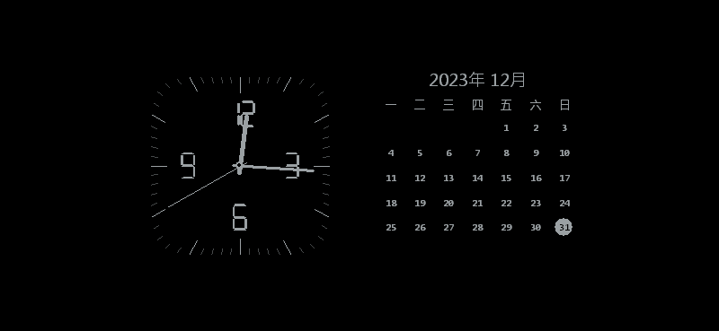
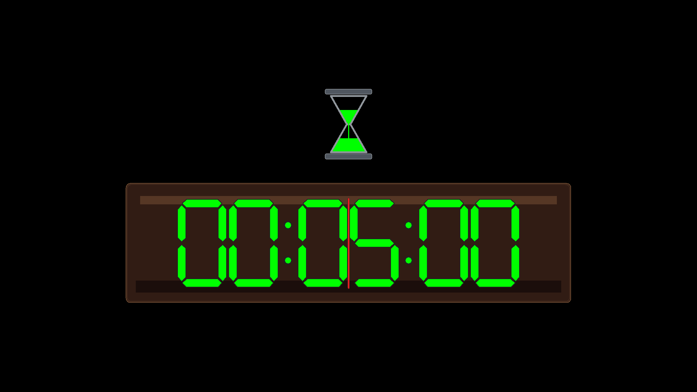
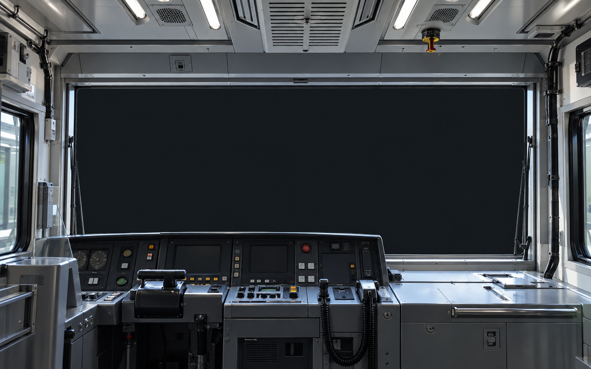
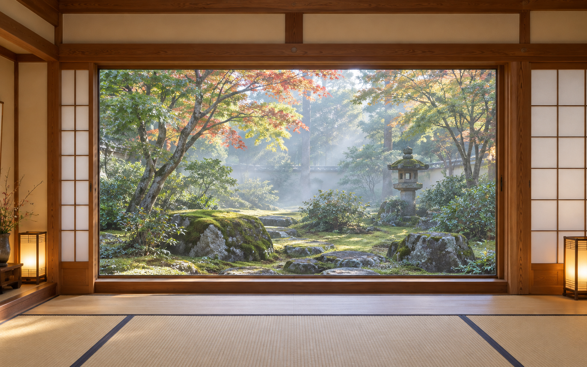
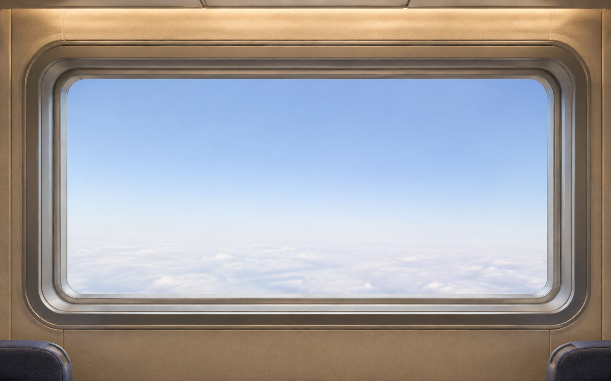
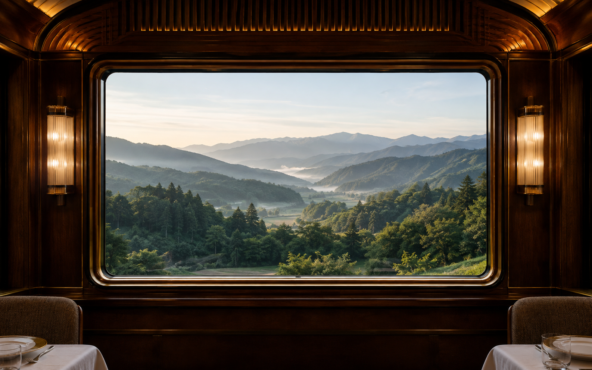

# 視覺參考與實作證據

產品版本：0.12.0 
規格文件：v2.5 
更新日期：2026-09-09

目前介面將既有場景顯示為「和風庭園」、「御運轉士」與「地方散策」，新增色彩顯示為「雪藍」、「琥珀」與「鐵灰色」。下方舊版段落保留各版本發布當時的名稱與證據檔名。

## v0.12.0 鐵灰與深棕玻璃

鐵灰色固定為 `RGB(154,160,163)`，自動模式每 2 分鐘循環七種固定色。番茄鐘面板以深棕內外層、棕銅框、上方反光與底部暗帶形成暗色藥劑瓶般的玻璃質感。Phase 18 共匯出 55 張 GDI fixture，涵蓋八個色彩選項與各尺寸／字型。

## v0.10.1 列車駕駛室與散步暗角修正

兩張新增素材都是依附件的視角概念重新生成的原創擬真 PNG，不包含附件像素、人物、文字、商標或特定營運者識別。

- [列車駕駛前方 GDI fallback](evidence/phase14/fixtures/47-JapanTravel-800x450-dpi96-p2-SevenSegment-train-cab.png)
- [散步模式 GDI fallback](evidence/phase14/fixtures/48-JapanTravel-800x450-dpi96-p2-SevenSegment-walking.png)
- [列車駕駛前方 HTML 橫向畫面](evidence/phase14/html/train-cab-1600x1000.png)
- [散步模式 HTML 全畫面攝影暗角](evidence/phase14/html/walking-1600x1000.png)
- [五場景 HTML 幾何結果](evidence/phase14/html/geometry.json)

列車駕駛 player 改為中央 42%×37.75% 的 16:9 區域，左右顯示擬真設備櫃、螢幕、通風板與金屬材質。散步 player 鋪滿 16:9 場景，徑向暗角從中央透明區逐步加深至全黑邊緣，主要視域約為中央 65%；素材不含眼球、皮膚或血管。700 ms 換片眨眼與 300 ms 載入點維持不變。

Phase 15 共匯出 52 張 GDI fixture 與 10 張封鎖網路的 headless HTML fixture。[Phase 15 報告](phase15-report.md)記錄命令、結果與未測項。

## v0.9.0 日式旅館與桌曆時鐘色彩

桌曆時鐘新增暗淺藍 `#6597B2`、琥珀色 `#FFBF00` 與每 2 分鐘自動切換。固定 tick 的離屏圖驗證兩種新色可完整畫出鐘面、指針與月曆；自動模式另由 119,999／120,000 ms 邊界與 720,000 ms 完整循環測試驗證。

| 色彩 | GDI 證據 |
| --- | --- |
| 暗淺藍 | [800×369 桌曆時鐘](evidence/phase13/fixtures/04-TimeDate-800x369-dpi96-p4-SevenSegment-palette.png) |
| 琥珀色 | [800×369 桌曆時鐘](evidence/phase13/fixtures/05-TimeDate-800x369-dpi96-p5-SevenSegment-palette.png) |

「日式旅館」使用原創 AI 擬真點陣圖，呈現自然木構、障子、榻榻米與庭園窗景。使用者附件只作空間語彙參考，沒有複製附件像素、家具配置或可識別旅館；素材沒有文字、商標或人物。

- [日式旅館 GDI fallback](evidence/phase13/fixtures/46-JapanTravel-800x450-dpi96-p2-SevenSegment-japanese-inn.png)
- [日式旅館 HTML 橫向窗孔驗證](evidence/phase13/html/japanese-inn-1600x1000.png)
- [三場景 HTML 幾何結果](evidence/phase13/html/geometry.json)

Phase 13 共重新匯出 50 張 GDI fixture 與 6 張封鎖網路的 headless HTML fixture。HTML 圖中的純色色塊代表完整 16:9 player 位置，沒有載入 YouTube 或即時影像；左上 2 px 綠色測試標記不屬於產品畫面。[Phase 13 報告](phase13-report.md)及 [生成提示與來源](travel-artwork.md)記錄驗證邊界與素材來源。

## v0.8.0 鐘面數字與擬真旅行場景

本版將鐘面的 12／3／6／9 目標字高由 `0.40R` 調整為 `0.30R`，縮小 25%；數字中心距離由 `0.62R` 改為 `0.58R`，使數字略向內收，與外側刻度保持間距。桌曆時鐘及番茄鐘仍使用既有置中內容區。[Phase 12 報告](phase12-report.md) 記錄 40 張重新匯出的 GDI fixture 與驗證邊界。

「自在飛行」與「列車旅行」改用原創 AI 擬真點陣圖，描繪虛構機艙及木質車廂的材質、窗框與景深。圖片透過內建 imagegen 產生，並非真實 A380 或特定列車照片，也沒有使用使用者附件的像素、第三方照片、商標或航空公司塗裝。

| 內附素材 | 用途 |
| --- | --- |
| [free-flight.png](../assets/travel/free-flight.png) | 自在飛行擬真機艙，1586×992 PNG |
| [train-journey.png](../assets/travel/train-journey.png) | 列車旅行擬真木質車廂，1586×992 PNG |

以上是程式內附的靜態素材。GDI 預覽以 Windows Imaging Component（WIC）本機解碼，設定與系統預覽不下載圖片、不連網；正式全螢幕的本機 HTML 使用同圖，在窗景中放置完整 16:9 YouTube player。窗框與地名／狀態不覆蓋影片、品牌、廣告或控制項。Pages 顯示相同素材，沒有載入第三方影片。

新增的來源切換控制項可選不切換或 1～1440 整數分鐘，預設 1；本輪沒有開啟原生設定視窗、全螢幕 player 或 UAC。因此離屏 GDI 圖片與內附素材不能當作實際影片、控制項 DPI 或雙螢幕播放的實機截圖。

另以獨立 headless Edge profile 匯出四張靜態 HTML 圖：

- [自在飛行／橫向](evidence/phase12/html/free-flight-1600x1000.png)
- [列車旅行／直向](evidence/phase12/html/train-journey-900x1600.png)
- [幾何檢查結果](evidence/phase12/html/geometry.json)

圖中的色塊表示完整 16:9 player 位置；沒有載入 YouTube 或即時影像。左上 2 px 綠色標記只用於測試驗證，不存在於產品畫面。[生成提示與來源](travel-artwork.md) 保留兩張圖的製作方式。

## v0.7.0 旅行狀態文字（歷史）

v0.7.0 當時重新匯出 40 張 GDI fixture，包括原有 37 張與新增的 3 種狀態。預覽明確標示為靜態預覽；全螢幕等待與錯誤文字取自該螢幕的狀態。[Phase 11 報告](phase11-report.md) 說明第二螢幕修正與測試邊界。以下為當時的向量窗框，並非 v0.8.0 擬真場景。

| 注入狀態 | GDI 文字證據 |
| --- | --- |
| 檢查來源 | [travel-checking](evidence/phase11/fixtures/37-JapanTravel-1920x1080-dpi96-p2-SevenSegment-travel-checking.png) |
| 播放中與地名 | [travel-playing](evidence/phase11/fixtures/38-JapanTravel-1920x1080-dpi96-p2-SevenSegment-travel-playing.png) |
| 播放器不可用 | [travel-unavailable](evidence/phase11/fixtures/39-JapanTravel-1920x1080-dpi96-p2-SevenSegment-travel-unavailable.png) |

這三張圖片用固定測試資料驗證文字與版面，沒有載入影片；「播放中」fixture 不能當作實際 WebView2 播放證據。

## v0.5.0 置中版面

日期時鐘與番茄鐘在一般桌面使用中央 64% 寬、60% 高的內容區，四周留白；小型預覽保持原有比例。[Phase 9 報告](phase9-report.md) 收錄本版 37 張 GDI renderer 圖片、尺寸門檻與驗證範圍。

4K、直向與小型預覽可由 Phase 9 畫面證據表開啟。這些圖片為離屏繪製，沒有開啟全螢幕或系統設定，也沒有觸發 UAC。以下 Phase 2～5 圖片與紀錄保留為歷史證據，不代表目前版面的尺寸。

## 參考範圍

使用者提供的私有圖片只作為標準桌曆暨時鐘模式的構圖參考：黑底、左側類比鐘、右側月曆、紅色前景及今天圓形標示。圖片沒有公開再授權依據，因此不納入 Git repository 或 Setup。產品沒有複製附件像素；鐘面、六列 Gregorian 月曆、字型縮放、配色和向量圖形由本專案原始碼產生。v0.8.0 旅行場景另使用上述內附原創 AI 圖片，GDI 負責解碼後的靜態呈現。

Classroom Timer 網址是倒數畫面的需求來源；開發期間沒有取得網頁內容，因此沒有宣稱與網站目前畫面逐像素一致。實作依規格固定為六位七段數字、沙漏、進度線、最後十秒外框和零點四次閃爍。

## 固定 fixture

[Phase 2 視覺檢查](phase2-visuals.md) 記錄各圖的固定日期、時間、倒數值、模式、色票、字型、畫布和 DPI。下列 PNG 由產品使用的同一套 GDI renderer 輸出，並非參考圖：

| 情境 | 證據 |
| --- | --- |
| 參考比例 800×369，標準桌曆暨時鐘模式，四色 | `docs/evidence/phase2/fixtures/00`～`03` |
| 1920×1080／96 DPI，標準桌曆暨時鐘模式 | [04-TimeDate-1920x1080](evidence/phase2/fixtures/04-TimeDate-1920x1080-dpi96-p2-SevenSegment-size.png) |
| 3840×2160／144 DPI，標準桌曆暨時鐘模式 | [05-TimeDate-3840x2160](evidence/phase2/fixtures/05-TimeDate-3840x2160-dpi144-p2-SevenSegment-size.png) |
| 1080×1920／192 DPI，標準桌曆暨時鐘模式 | [06-TimeDate-1080x1920](evidence/phase2/fixtures/06-TimeDate-1080x1920-dpi192-p2-SevenSegment-size.png) |
| 極小 120×80／288 DPI，標準桌曆暨時鐘模式 | [08-TimeDate-120x80](evidence/phase2/fixtures/08-TimeDate-120x80-dpi288-p2-SevenSegment-size.png) |
| 參考比例 800×369，離機作業番茄鐘模式，四色 | `docs/evidence/phase2/fixtures/11`～`14` |
| 1920×1080／96 DPI，離機作業番茄鐘模式 | [15-Countdown-1920x1080](evidence/phase2/fixtures/15-Countdown-1920x1080-dpi96-p2-SevenSegment-size.png) |
| 3840×2160／144 DPI，離機作業番茄鐘模式 | [16-Countdown-3840x2160](evidence/phase2/fixtures/16-Countdown-3840x2160-dpi144-p2-SevenSegment-size.png) |
| 1080×1920／192 DPI，離機作業番茄鐘模式 | [17-Countdown-1080x1920](evidence/phase2/fixtures/17-Countdown-1080x1920-dpi192-p2-SevenSegment-size.png) |
| 極小 120×80／288 DPI，離機作業番茄鐘模式 | [19-Countdown-120x80](evidence/phase2/fixtures/19-Countdown-120x80-dpi288-p2-SevenSegment-size.png) |
| 最後十秒、暗半週期、完成狀態 | `docs/evidence/phase2/fixtures/22`～`24` |

標準桌曆暨時鐘模式的固定 fixture 使用 2023-12-31 12:15:40；正常產品模式仍讀取真實系統時間。fixture 同時驗證六列月曆、星期一為首欄、今天標示、指針連續角度、左右／上下切換及極小空間退化。

## Win10 原生對話框

本機為 Windows 10 Education 22H2 x64、build 19045.6456，雙 3840×2160 顯示器，兩者 144 DPI／150%。

- [設定對話框（150%）](evidence/phase3/config-dialog-win10-150.png)：繁體中文標籤、四種色票、四種字型入口、owner-draw 即時預覽及確定／取消。
- [倒數輸入（150%）](evidence/phase3/countdown-dialog-win10-150.png)：時／分／秒欄位、預填、錯誤列及開始／取消。

上述截圖是 Phase 3 歷史證據。v0.1.1 設定畫面已加入「KOMSMOS TOOLKIT 探真拓知酷」識別，目前由非互動 smoke test 檢查內嵌資源字串；尚未以新的互動截圖補證。

100%／200% 實體對話框、混合 DPI 實體桌面及 Windows 11 沒有可用環境，狀態為 `NOT TESTED`。既有 96／144／192／288 DPI fixture 與三種 preview host DPI context 不能代替這些實機畫面。

## Phase 5 安裝畫面

Setup 已由 Inno Setup 6.7.3 編譯，task 文案和解除安裝提示存在於 `installer/tools-screensaver-tzk.iss`。本輪 UAC 被取消，未完成安裝精靈、Windows 螢幕保護設定頁列舉或解除安裝提示的實機截圖，因此這些畫面為 `NOT TESTED`，沒有以編譯成功冒充視覺驗證。
